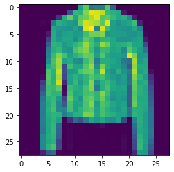
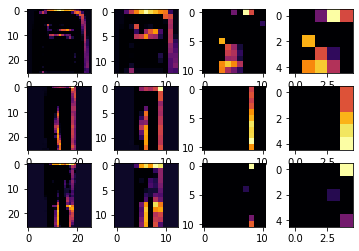
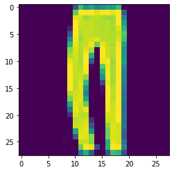
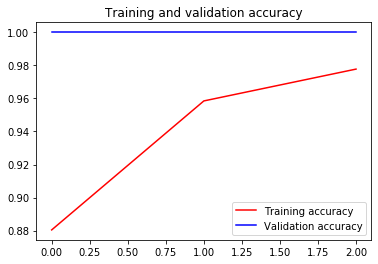
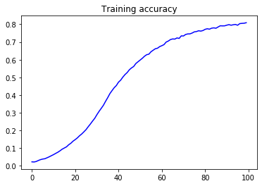
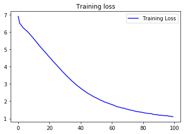
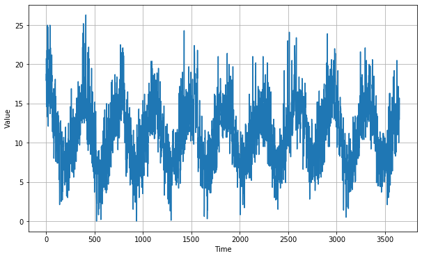
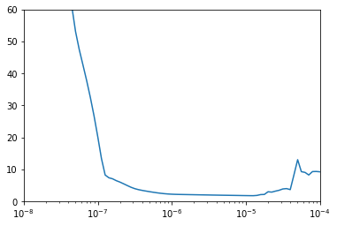
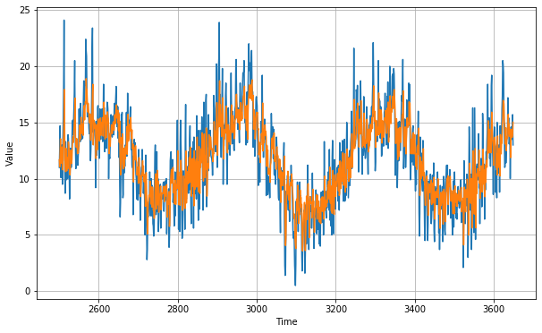

**本文主要分享 TensorFlow Certificate 认证考试的视频讲解，以及 TensorFlow In Practice 课程的案例代码解读，如有错误不足之处，望读者指正提醒，谢谢！**


## Part 1 - TensorFlow Certificate 开发者证书 中文手册

文章地址Url 请点击图片：

[](https://github.com/pepure/TensorFlow-In-Practice-Code-Review/blob/master/TensorFlowCertificate.md))


## Part 2 - TensorFlow Certificate & 示例代码 视频讲解

视频地址Url 请点击图片（或长按二维码前往）：

[](https://www.bilibili.com/video/BV1wf4y117qF/?p=2)

[](https://www.bilibili.com/video/BV1wf4y117qF/?p=2)


## Part 3 - TensorFlow In Practice 示例代码 下载地址

示例代码地址Url 请点击图片（或长按二维码前往）：

[](https://github.com/pepure/TensorFlow-In-Practice-Code-Review)

[](https://github.com/pepure/TensorFlow-In-Practice-Code-Review)


## Part 4 - TensorFlow In Practice 示例代码 解读


### L1 - 卷积神经网络的卷积层可视化

```python
import tensorflow as tf
import numpy as np
print(tf.__version__)
```

    2.0.0


1. 载入fashion-mnist数据集


```python
mnist = tf.keras.datasets.fashion_mnist
(training_images, training_labels), (test_images, test_labels) = mnist.load_data()
```

2. 数据集维度调整 → 归一化


```python
training_images=training_images.reshape(60000, 28, 28, 1)
training_images=training_images / 255.0
test_images = test_images.reshape(10000, 28, 28, 1)
test_images=test_images/255.0
```

3. 卷积神经网络（7层）模型搭建


```python
model = tf.keras.models.Sequential([
  tf.keras.layers.Conv2D(64, (3,3), activation='relu', input_shape=(28, 28, 1)),
  tf.keras.layers.MaxPooling2D(2, 2),
  tf.keras.layers.Conv2D(64, (3,3), activation='relu'),
  tf.keras.layers.MaxPooling2D(2,2),
  tf.keras.layers.Flatten(),
  tf.keras.layers.Dense(128, activation='relu'),
  tf.keras.layers.Dense(10, activation='softmax')
])
```

4. 模型编译并打印确认


```python
model.compile(optimizer='adam', loss='sparse_categorical_crossentropy', metrics=['accuracy'])
model.summary()
```

    Model: "sequential"
    _________________________________________________________________
    Layer (type)                 Output Shape              Param #   
    =================================================================
    conv2d (Conv2D)              (None, 26, 26, 64)        640       
    _________________________________________________________________
    max_pooling2d (MaxPooling2D) (None, 13, 13, 64)        0         
    _________________________________________________________________
    conv2d_1 (Conv2D)            (None, 11, 11, 64)        36928     
    _________________________________________________________________
    max_pooling2d_1 (MaxPooling2 (None, 5, 5, 64)          0         
    _________________________________________________________________
    flatten (Flatten)            (None, 1600)              0         
    _________________________________________________________________
    dense (Dense)                (None, 128)               204928    
    _________________________________________________________________
    dense_1 (Dense)              (None, 10)                1290      
    =================================================================
    Total params: 243,786
    Trainable params: 243,786
    Non-trainable params: 0
    _________________________________________________________________


5. 模型训练 5epochs


```python
model.fit(training_images, training_labels, epochs=5)
```

    Train on 60000 samples
    Epoch 1/5
    60000/60000 [==============================] - 30s 497us/sample - loss: 0.4412 - accuracy: 0.8394
    Epoch 2/5
    60000/60000 [==============================] - 28s 460us/sample - loss: 0.2943 - accuracy: 0.8917
    Epoch 3/5
    60000/60000 [==============================] - 28s 462us/sample - loss: 0.2477 - accuracy: 0.9087
    Epoch 4/5
    60000/60000 [==============================] - 28s 462us/sample - loss: 0.2152 - accuracy: 0.9197- loss: 0
    Epoch 5/5
    60000/60000 [==============================] - 28s 462us/sample - loss: 0.1886 - accuracy: 0.9294


    <tensorflow.python.keras.callbacks.History at 0x2171badb988>


6. 模型评估


```python
print(model.metrics_names)
test_result = model.evaluate(test_images, test_labels)
print(test_result)
```

    ['loss', 'accuracy']
    10000/1 [=====] - 2s 208us/sample - loss: 0.3470 - accuracy: 0.9067
    [0.2572713972091675, 0.9067]


7. 模型预测


```python
import matplotlib.pyplot as plt
print(test_labels[10])
test_predict = model.predict(test_images[10].reshape(1, 28, 28, 1))
print(test_predict)
test_class = np.argmax (test_predict)
print(test_class)
plt.imshow(test_images[10].reshape(28, 28))
```

    4
    [[7.1008303e-06 5.2014681e-08 1.4161319e-03 3.0919534e-08 9.9363470e-01
      2.7881402e-09 4.9417536e-03 1.5619010e-08 5.4633844e-08 2.0269648e-07]]
    4


    <matplotlib.image.AxesImage at 0x217c3a52fc8>





8. 好玩的内容：输出CNN网络中间层学习到的内容


```python
f, axarr = plt.subplots(3,4)
FIRST_IMAGE=1
SECOND_IMAGE=2
THIRD_IMAGE=3
CONVOLUTION_NUMBER = 30 #第2个核学到的
from tensorflow.keras import models
layer_outputs = [layer.output for layer in model.layers]
activation_model = tf.keras.models.Model(inputs = model.input, outputs = layer_outputs)
for x in range(0,4):#2个卷积和2个MaxPool
  f1 = activation_model.predict(test_images[FIRST_IMAGE].reshape(1, 28, 28, 1))[x]
  axarr[0,x].imshow(f1[0, : , :, CONVOLUTION_NUMBER], cmap='inferno')
  axarr[0,x].grid(False)
  f2 = activation_model.predict(test_images[SECOND_IMAGE].reshape(1, 28, 28, 1))[x]
  axarr[1,x].imshow(f2[0, : , :, CONVOLUTION_NUMBER], cmap='inferno')
  axarr[1,x].grid(False)
  f3 = activation_model.predict(test_images[THIRD_IMAGE].reshape(1, 28, 28, 1))[x]
  axarr[2,x].imshow(f3[0, : , :, CONVOLUTION_NUMBER], cmap='inferno')
  axarr[2,x].grid(False)
```





答案揭晓：


```python
plt.imshow(test_images[2].reshape(28, 28))
```


    <matplotlib.image.AxesImage at 0x217c6507cc8>





9. End


### L2 - 迁移学习的简单尝试

本案例主要使用InceptionV3模型进行迁移学习，来进行"人和马训练集"的分类。

1. 导入类库，包括keras自带的InceptionV3模型


```python
import os
import tensorflow as tf
from tensorflow.keras import layers
from tensorflow.keras import Model
from os import getcwd

from tensorflow.keras.applications.inception_v3 import InceptionV3
```

2. 载入InceptionV3模型
   include_top = False，不包含最后一层全连接层


```python
pre_trained_model = InceptionV3(input_shape = (150, 150, 3), 
                                include_top = False, 
                                weights = None)
```

3. 导入预训练的参数(李飞飞ImageNet训练集)


```python
local_weights_file = "tmp/inception_v3_weights_tf_dim_ordering_tf_kernels_notop.h5"
pre_trained_model.load_weights(local_weights_file)
```

4. 冻结所有参数，不参与新的训练集的训练


```python
for layer in pre_trained_model.layers:
    layer.trainable = False
```

5. 打印预训练模型的结构
   我们可以看到，InceptionV3是有个很深的网络模型，得益于巧妙的Inception结构，使得该模型的梯度不会消失


```python
pre_trained_model.summary()
```

    Model: "inception_v3"
    __________________________________________________________________________________________________
    Layer (type)                    Output Shape         Param #     Connected to                     
    ==================================================================================================
    input_1 (InputLayer)            [(None, 150, 150, 3) 0                                            
    __________________________________________________________________________________________________
    conv2d (Conv2D)                 (None, 74, 74, 32)   864         input_1[0][0]                    
    __________________________________________________________________________________________________
    batch_normalization (BatchNorma (None, 74, 74, 32)   96          conv2d[0][0]                     
    __________________________________________________________________________________________________
    activation (Activation)         (None, 74, 74, 32)   0           batch_normalization[0][0]        
    __________________________________________________________________________________________________
    conv2d_1 (Conv2D)               (None, 72, 72, 32)   9216        activation[0][0]                 
    __________________________________________________________________________________________________
    batch_normalization_1 (BatchNor (None, 72, 72, 32)   96          conv2d_1[0][0]                   
    __________________________________________________________________________________________________
    activation_1 (Activation)       (None, 72, 72, 32)   0           batch_normalization_1[0][0]      
    __________________________________________________________________________________________________
    conv2d_2 (Conv2D)               (None, 72, 72, 64)   18432       activation_1[0][0]               
    __________________________________________________________________________________________________
    batch_normalization_2 (BatchNor (None, 72, 72, 64)   192         conv2d_2[0][0]                   
    __________________________________________________________________________________________________
    activation_2 (Activation)       (None, 72, 72, 64)   0           batch_normalization_2[0][0]      
    __________________________________________________________________________________________________
    max_pooling2d (MaxPooling2D)    (None, 35, 35, 64)   0           activation_2[0][0]               
    __________________________________________________________________________________________________
    conv2d_3 (Conv2D)               (None, 35, 35, 80)   5120        max_pooling2d[0][0]              
    __________________________________________________________________________________________________
    batch_normalization_3 (BatchNor (None, 35, 35, 80)   240         conv2d_3[0][0]                   
    __________________________________________________________________________________________________
    activation_3 (Activation)       (None, 35, 35, 80)   0           batch_normalization_3[0][0]      
    __________________________________________________________________________________________________
    conv2d_4 (Conv2D)               (None, 33, 33, 192)  138240      activation_3[0][0]               
    __________________________________________________________________________________________________
    batch_normalization_4 (BatchNor (None, 33, 33, 192)  576         conv2d_4[0][0]                   
    __________________________________________________________________________________________________
    activation_4 (Activation)       (None, 33, 33, 192)  0           batch_normalization_4[0][0]      
    __________________________________________________________________________________________________
    max_pooling2d_1 (MaxPooling2D)  (None, 16, 16, 192)  0           activation_4[0][0]               
    __________________________________________________________________________________________________
    conv2d_8 (Conv2D)               (None, 16, 16, 64)   12288       max_pooling2d_1[0][0]            
    __________________________________________________________________________________________________
    batch_normalization_8 (BatchNor (None, 16, 16, 64)   192         conv2d_8[0][0]                   
    __________________________________________________________________________________________________
    activation_8 (Activation)       (None, 16, 16, 64)   0           batch_normalization_8[0][0]      
    __________________________________________________________________________________________________
    conv2d_6 (Conv2D)               (None, 16, 16, 48)   9216        max_pooling2d_1[0][0]            
    __________________________________________________________________________________________________
    conv2d_9 (Conv2D)               (None, 16, 16, 96)   55296       activation_8[0][0]               
    __________________________________________________________________________________________________
    batch_normalization_6 (BatchNor (None, 16, 16, 48)   144         conv2d_6[0][0]                   
    __________________________________________________________________________________________________
    batch_normalization_9 (BatchNor (None, 16, 16, 96)   288         conv2d_9[0][0]                   
    __________________________________________________________________________________________________
    activation_6 (Activation)       (None, 16, 16, 48)   0           batch_normalization_6[0][0]      
    __________________________________________________________________________________________________
    activation_9 (Activation)       (None, 16, 16, 96)   0           batch_normalization_9[0][0]      
    __________________________________________________________________________________________________
    average_pooling2d (AveragePooli (None, 16, 16, 192)  0           max_pooling2d_1[0][0]            
    __________________________________________________________________________________________________
    conv2d_5 (Conv2D)               (None, 16, 16, 64)   12288       max_pooling2d_1[0][0]            
    __________________________________________________________________________________________________
    conv2d_7 (Conv2D)               (None, 16, 16, 64)   76800       activation_6[0][0]               
    __________________________________________________________________________________________________
    conv2d_10 (Conv2D)              (None, 16, 16, 96)   82944       activation_9[0][0]               
    __________________________________________________________________________________________________
    conv2d_11 (Conv2D)              (None, 16, 16, 32)   6144        average_pooling2d[0][0]          
    __________________________________________________________________________________________________
    batch_normalization_5 (BatchNor (None, 16, 16, 64)   192         conv2d_5[0][0]                   
    __________________________________________________________________________________________________
    batch_normalization_7 (BatchNor (None, 16, 16, 64)   192         conv2d_7[0][0]                   
    __________________________________________________________________________________________________
    batch_normalization_10 (BatchNo (None, 16, 16, 96)   288         conv2d_10[0][0]                  
    __________________________________________________________________________________________________
    batch_normalization_11 (BatchNo (None, 16, 16, 32)   96          conv2d_11[0][0]                  
    __________________________________________________________________________________________________
    activation_5 (Activation)       (None, 16, 16, 64)   0           batch_normalization_5[0][0]      
    __________________________________________________________________________________________________
    activation_7 (Activation)       (None, 16, 16, 64)   0           batch_normalization_7[0][0]      
    __________________________________________________________________________________________________
    activation_10 (Activation)      (None, 16, 16, 96)   0           batch_normalization_10[0][0]     
    __________________________________________________________________________________________________
    activation_11 (Activation)      (None, 16, 16, 32)   0           batch_normalization_11[0][0]     
    __________________________________________________________________________________________________
    mixed0 (Concatenate)            (None, 16, 16, 256)  0           activation_5[0][0]               
                                                                     activation_7[0][0]               
                                                                     activation_10[0][0]              
                                                                     activation_11[0][0]              
    __________________________________________________________________________________________________
    conv2d_15 (Conv2D)              (None, 16, 16, 64)   16384       mixed0[0][0]                     
    __________________________________________________________________________________________________
    batch_normalization_15 (BatchNo (None, 16, 16, 64)   192         conv2d_15[0][0]                  
    __________________________________________________________________________________________________
    activation_15 (Activation)      (None, 16, 16, 64)   0           batch_normalization_15[0][0]     
    __________________________________________________________________________________________________
    conv2d_13 (Conv2D)              (None, 16, 16, 48)   12288       mixed0[0][0]                     
    __________________________________________________________________________________________________
    conv2d_16 (Conv2D)              (None, 16, 16, 96)   55296       activation_15[0][0]              
    __________________________________________________________________________________________________
    batch_normalization_13 (BatchNo (None, 16, 16, 48)   144         conv2d_13[0][0]                  
    __________________________________________________________________________________________________
    batch_normalization_16 (BatchNo (None, 16, 16, 96)   288         conv2d_16[0][0]                  
    __________________________________________________________________________________________________
    activation_13 (Activation)      (None, 16, 16, 48)   0           batch_normalization_13[0][0]     
    __________________________________________________________________________________________________
    activation_16 (Activation)      (None, 16, 16, 96)   0           batch_normalization_16[0][0]     
    __________________________________________________________________________________________________
    average_pooling2d_1 (AveragePoo (None, 16, 16, 256)  0           mixed0[0][0]                     
    __________________________________________________________________________________________________
    conv2d_12 (Conv2D)              (None, 16, 16, 64)   16384       mixed0[0][0]                     
    __________________________________________________________________________________________________
    conv2d_14 (Conv2D)              (None, 16, 16, 64)   76800       activation_13[0][0]              
    __________________________________________________________________________________________________
    conv2d_17 (Conv2D)              (None, 16, 16, 96)   82944       activation_16[0][0]              
    __________________________________________________________________________________________________
    conv2d_18 (Conv2D)              (None, 16, 16, 64)   16384       average_pooling2d_1[0][0]        
    __________________________________________________________________________________________________
    batch_normalization_12 (BatchNo (None, 16, 16, 64)   192         conv2d_12[0][0]                  
    __________________________________________________________________________________________________
    batch_normalization_14 (BatchNo (None, 16, 16, 64)   192         conv2d_14[0][0]                  
    __________________________________________________________________________________________________
    batch_normalization_17 (BatchNo (None, 16, 16, 96)   288         conv2d_17[0][0]                  
    __________________________________________________________________________________________________
    batch_normalization_18 (BatchNo (None, 16, 16, 64)   192         conv2d_18[0][0]                  
    __________________________________________________________________________________________________
    activation_12 (Activation)      (None, 16, 16, 64)   0           batch_normalization_12[0][0]     
    __________________________________________________________________________________________________
    activation_14 (Activation)      (None, 16, 16, 64)   0           batch_normalization_14[0][0]     
    __________________________________________________________________________________________________
    activation_17 (Activation)      (None, 16, 16, 96)   0           batch_normalization_17[0][0]     
    __________________________________________________________________________________________________
    activation_18 (Activation)      (None, 16, 16, 64)   0           batch_normalization_18[0][0]     
    __________________________________________________________________________________________________
    mixed1 (Concatenate)            (None, 16, 16, 288)  0           activation_12[0][0]              
                                                                     activation_14[0][0]              
                                                                     activation_17[0][0]              
                                                                     activation_18[0][0]              
    __________________________________________________________________________________________________
    conv2d_22 (Conv2D)              (None, 16, 16, 64)   18432       mixed1[0][0]                     
    __________________________________________________________________________________________________
    batch_normalization_22 (BatchNo (None, 16, 16, 64)   192         conv2d_22[0][0]                  
    __________________________________________________________________________________________________
    activation_22 (Activation)      (None, 16, 16, 64)   0           batch_normalization_22[0][0]     
    __________________________________________________________________________________________________
    conv2d_20 (Conv2D)              (None, 16, 16, 48)   13824       mixed1[0][0]                     
    __________________________________________________________________________________________________
    conv2d_23 (Conv2D)              (None, 16, 16, 96)   55296       activation_22[0][0]              
    __________________________________________________________________________________________________
    batch_normalization_20 (BatchNo (None, 16, 16, 48)   144         conv2d_20[0][0]                  
    __________________________________________________________________________________________________
    batch_normalization_23 (BatchNo (None, 16, 16, 96)   288         conv2d_23[0][0]                  
    __________________________________________________________________________________________________
    activation_20 (Activation)      (None, 16, 16, 48)   0           batch_normalization_20[0][0]     
    __________________________________________________________________________________________________
    activation_23 (Activation)      (None, 16, 16, 96)   0           batch_normalization_23[0][0]     
    __________________________________________________________________________________________________
    average_pooling2d_2 (AveragePoo (None, 16, 16, 288)  0           mixed1[0][0]                     
    __________________________________________________________________________________________________
    conv2d_19 (Conv2D)              (None, 16, 16, 64)   18432       mixed1[0][0]                     
    __________________________________________________________________________________________________
    conv2d_21 (Conv2D)              (None, 16, 16, 64)   76800       activation_20[0][0]              
    __________________________________________________________________________________________________
    conv2d_24 (Conv2D)              (None, 16, 16, 96)   82944       activation_23[0][0]              
    __________________________________________________________________________________________________
    conv2d_25 (Conv2D)              (None, 16, 16, 64)   18432       average_pooling2d_2[0][0]        
    __________________________________________________________________________________________________
    batch_normalization_19 (BatchNo (None, 16, 16, 64)   192         conv2d_19[0][0]                  
    __________________________________________________________________________________________________
    batch_normalization_21 (BatchNo (None, 16, 16, 64)   192         conv2d_21[0][0]                  
    __________________________________________________________________________________________________
    batch_normalization_24 (BatchNo (None, 16, 16, 96)   288         conv2d_24[0][0]                  
    __________________________________________________________________________________________________
    batch_normalization_25 (BatchNo (None, 16, 16, 64)   192         conv2d_25[0][0]                  
    __________________________________________________________________________________________________
    activation_19 (Activation)      (None, 16, 16, 64)   0           batch_normalization_19[0][0]     
    __________________________________________________________________________________________________
    activation_21 (Activation)      (None, 16, 16, 64)   0           batch_normalization_21[0][0]     
    __________________________________________________________________________________________________
    activation_24 (Activation)      (None, 16, 16, 96)   0           batch_normalization_24[0][0]     
    __________________________________________________________________________________________________
    activation_25 (Activation)      (None, 16, 16, 64)   0           batch_normalization_25[0][0]     
    __________________________________________________________________________________________________
    mixed2 (Concatenate)            (None, 16, 16, 288)  0           activation_19[0][0]              
                                                                     activation_21[0][0]              
                                                                     activation_24[0][0]              
                                                                     activation_25[0][0]              
    __________________________________________________________________________________________________
    conv2d_27 (Conv2D)              (None, 16, 16, 64)   18432       mixed2[0][0]                     
    __________________________________________________________________________________________________
    batch_normalization_27 (BatchNo (None, 16, 16, 64)   192         conv2d_27[0][0]                  
    __________________________________________________________________________________________________
    activation_27 (Activation)      (None, 16, 16, 64)   0           batch_normalization_27[0][0]     
    __________________________________________________________________________________________________
    conv2d_28 (Conv2D)              (None, 16, 16, 96)   55296       activation_27[0][0]              
    __________________________________________________________________________________________________
    batch_normalization_28 (BatchNo (None, 16, 16, 96)   288         conv2d_28[0][0]                  
    __________________________________________________________________________________________________
    activation_28 (Activation)      (None, 16, 16, 96)   0           batch_normalization_28[0][0]     
    __________________________________________________________________________________________________
    conv2d_26 (Conv2D)              (None, 7, 7, 384)    995328      mixed2[0][0]                     
    __________________________________________________________________________________________________
    conv2d_29 (Conv2D)              (None, 7, 7, 96)     82944       activation_28[0][0]              
    __________________________________________________________________________________________________
    batch_normalization_26 (BatchNo (None, 7, 7, 384)    1152        conv2d_26[0][0]                  
    __________________________________________________________________________________________________
    batch_normalization_29 (BatchNo (None, 7, 7, 96)     288         conv2d_29[0][0]                  
    __________________________________________________________________________________________________
    activation_26 (Activation)      (None, 7, 7, 384)    0           batch_normalization_26[0][0]     
    __________________________________________________________________________________________________
    activation_29 (Activation)      (None, 7, 7, 96)     0           batch_normalization_29[0][0]     
    __________________________________________________________________________________________________
    max_pooling2d_2 (MaxPooling2D)  (None, 7, 7, 288)    0           mixed2[0][0]                     
    __________________________________________________________________________________________________
    mixed3 (Concatenate)            (None, 7, 7, 768)    0           activation_26[0][0]              
                                                                     activation_29[0][0]              
                                                                     max_pooling2d_2[0][0]            
    __________________________________________________________________________________________________
    conv2d_34 (Conv2D)              (None, 7, 7, 128)    98304       mixed3[0][0]                     
    __________________________________________________________________________________________________
    batch_normalization_34 (BatchNo (None, 7, 7, 128)    384         conv2d_34[0][0]                  
    __________________________________________________________________________________________________
    activation_34 (Activation)      (None, 7, 7, 128)    0           batch_normalization_34[0][0]     
    __________________________________________________________________________________________________
    conv2d_35 (Conv2D)              (None, 7, 7, 128)    114688      activation_34[0][0]              
    __________________________________________________________________________________________________
    batch_normalization_35 (BatchNo (None, 7, 7, 128)    384         conv2d_35[0][0]                  
    __________________________________________________________________________________________________
    activation_35 (Activation)      (None, 7, 7, 128)    0           batch_normalization_35[0][0]     
    __________________________________________________________________________________________________
    conv2d_31 (Conv2D)              (None, 7, 7, 128)    98304       mixed3[0][0]                     
    __________________________________________________________________________________________________
    conv2d_36 (Conv2D)              (None, 7, 7, 128)    114688      activation_35[0][0]              
    __________________________________________________________________________________________________
    batch_normalization_31 (BatchNo (None, 7, 7, 128)    384         conv2d_31[0][0]                  
    __________________________________________________________________________________________________
    batch_normalization_36 (BatchNo (None, 7, 7, 128)    384         conv2d_36[0][0]                  
    __________________________________________________________________________________________________
    activation_31 (Activation)      (None, 7, 7, 128)    0           batch_normalization_31[0][0]     
    __________________________________________________________________________________________________
    activation_36 (Activation)      (None, 7, 7, 128)    0           batch_normalization_36[0][0]     
    __________________________________________________________________________________________________
    conv2d_32 (Conv2D)              (None, 7, 7, 128)    114688      activation_31[0][0]              
    __________________________________________________________________________________________________
    conv2d_37 (Conv2D)              (None, 7, 7, 128)    114688      activation_36[0][0]              
    __________________________________________________________________________________________________
    batch_normalization_32 (BatchNo (None, 7, 7, 128)    384         conv2d_32[0][0]                  
    __________________________________________________________________________________________________
    batch_normalization_37 (BatchNo (None, 7, 7, 128)    384         conv2d_37[0][0]                  
    __________________________________________________________________________________________________
    activation_32 (Activation)      (None, 7, 7, 128)    0           batch_normalization_32[0][0]     
    __________________________________________________________________________________________________
    activation_37 (Activation)      (None, 7, 7, 128)    0           batch_normalization_37[0][0]     
    __________________________________________________________________________________________________
    average_pooling2d_3 (AveragePoo (None, 7, 7, 768)    0           mixed3[0][0]                     
    __________________________________________________________________________________________________
    conv2d_30 (Conv2D)              (None, 7, 7, 192)    147456      mixed3[0][0]                     
    __________________________________________________________________________________________________
    conv2d_33 (Conv2D)              (None, 7, 7, 192)    172032      activation_32[0][0]              
    __________________________________________________________________________________________________
    conv2d_38 (Conv2D)              (None, 7, 7, 192)    172032      activation_37[0][0]              
    __________________________________________________________________________________________________
    conv2d_39 (Conv2D)              (None, 7, 7, 192)    147456      average_pooling2d_3[0][0]        
    __________________________________________________________________________________________________
    batch_normalization_30 (BatchNo (None, 7, 7, 192)    576         conv2d_30[0][0]                  
    __________________________________________________________________________________________________
    batch_normalization_33 (BatchNo (None, 7, 7, 192)    576         conv2d_33[0][0]                  
    __________________________________________________________________________________________________
    batch_normalization_38 (BatchNo (None, 7, 7, 192)    576         conv2d_38[0][0]                  
    __________________________________________________________________________________________________
    batch_normalization_39 (BatchNo (None, 7, 7, 192)    576         conv2d_39[0][0]                  
    __________________________________________________________________________________________________
    activation_30 (Activation)      (None, 7, 7, 192)    0           batch_normalization_30[0][0]     
    __________________________________________________________________________________________________
    activation_33 (Activation)      (None, 7, 7, 192)    0           batch_normalization_33[0][0]     
    __________________________________________________________________________________________________
    activation_38 (Activation)      (None, 7, 7, 192)    0           batch_normalization_38[0][0]     
    __________________________________________________________________________________________________
    activation_39 (Activation)      (None, 7, 7, 192)    0           batch_normalization_39[0][0]     
    __________________________________________________________________________________________________
    mixed4 (Concatenate)            (None, 7, 7, 768)    0           activation_30[0][0]              
                                                                     activation_33[0][0]              
                                                                     activation_38[0][0]              
                                                                     activation_39[0][0]              
    __________________________________________________________________________________________________
    conv2d_44 (Conv2D)              (None, 7, 7, 160)    122880      mixed4[0][0]                     
    __________________________________________________________________________________________________
    batch_normalization_44 (BatchNo (None, 7, 7, 160)    480         conv2d_44[0][0]                  
    __________________________________________________________________________________________________
    activation_44 (Activation)      (None, 7, 7, 160)    0           batch_normalization_44[0][0]     
    __________________________________________________________________________________________________
    conv2d_45 (Conv2D)              (None, 7, 7, 160)    179200      activation_44[0][0]              
    __________________________________________________________________________________________________
    batch_normalization_45 (BatchNo (None, 7, 7, 160)    480         conv2d_45[0][0]                  
    __________________________________________________________________________________________________
    activation_45 (Activation)      (None, 7, 7, 160)    0           batch_normalization_45[0][0]     
    __________________________________________________________________________________________________
    conv2d_41 (Conv2D)              (None, 7, 7, 160)    122880      mixed4[0][0]                     
    __________________________________________________________________________________________________
    conv2d_46 (Conv2D)              (None, 7, 7, 160)    179200      activation_45[0][0]              
    __________________________________________________________________________________________________
    batch_normalization_41 (BatchNo (None, 7, 7, 160)    480         conv2d_41[0][0]                  
    __________________________________________________________________________________________________
    batch_normalization_46 (BatchNo (None, 7, 7, 160)    480         conv2d_46[0][0]                  
    __________________________________________________________________________________________________
    activation_41 (Activation)      (None, 7, 7, 160)    0           batch_normalization_41[0][0]     
    __________________________________________________________________________________________________
    activation_46 (Activation)      (None, 7, 7, 160)    0           batch_normalization_46[0][0]     
    __________________________________________________________________________________________________
    conv2d_42 (Conv2D)              (None, 7, 7, 160)    179200      activation_41[0][0]              
    __________________________________________________________________________________________________
    conv2d_47 (Conv2D)              (None, 7, 7, 160)    179200      activation_46[0][0]              
    __________________________________________________________________________________________________
    batch_normalization_42 (BatchNo (None, 7, 7, 160)    480         conv2d_42[0][0]                  
    __________________________________________________________________________________________________
    batch_normalization_47 (BatchNo (None, 7, 7, 160)    480         conv2d_47[0][0]                  
    __________________________________________________________________________________________________
    activation_42 (Activation)      (None, 7, 7, 160)    0           batch_normalization_42[0][0]     
    __________________________________________________________________________________________________
    activation_47 (Activation)      (None, 7, 7, 160)    0           batch_normalization_47[0][0]     
    __________________________________________________________________________________________________
    average_pooling2d_4 (AveragePoo (None, 7, 7, 768)    0           mixed4[0][0]                     
    __________________________________________________________________________________________________
    conv2d_40 (Conv2D)              (None, 7, 7, 192)    147456      mixed4[0][0]                     
    __________________________________________________________________________________________________
    conv2d_43 (Conv2D)              (None, 7, 7, 192)    215040      activation_42[0][0]              
    __________________________________________________________________________________________________
    conv2d_48 (Conv2D)              (None, 7, 7, 192)    215040      activation_47[0][0]              
    __________________________________________________________________________________________________
    conv2d_49 (Conv2D)              (None, 7, 7, 192)    147456      average_pooling2d_4[0][0]        
    __________________________________________________________________________________________________
    batch_normalization_40 (BatchNo (None, 7, 7, 192)    576         conv2d_40[0][0]                  
    __________________________________________________________________________________________________
    batch_normalization_43 (BatchNo (None, 7, 7, 192)    576         conv2d_43[0][0]                  
    __________________________________________________________________________________________________
    batch_normalization_48 (BatchNo (None, 7, 7, 192)    576         conv2d_48[0][0]                  
    __________________________________________________________________________________________________
    batch_normalization_49 (BatchNo (None, 7, 7, 192)    576         conv2d_49[0][0]                  
    __________________________________________________________________________________________________
    activation_40 (Activation)      (None, 7, 7, 192)    0           batch_normalization_40[0][0]     
    __________________________________________________________________________________________________
    activation_43 (Activation)      (None, 7, 7, 192)    0           batch_normalization_43[0][0]     
    __________________________________________________________________________________________________
    activation_48 (Activation)      (None, 7, 7, 192)    0           batch_normalization_48[0][0]     
    __________________________________________________________________________________________________
    activation_49 (Activation)      (None, 7, 7, 192)    0           batch_normalization_49[0][0]     
    __________________________________________________________________________________________________
    mixed5 (Concatenate)            (None, 7, 7, 768)    0           activation_40[0][0]              
                                                                     activation_43[0][0]              
                                                                     activation_48[0][0]              
                                                                     activation_49[0][0]              
    __________________________________________________________________________________________________
    conv2d_54 (Conv2D)              (None, 7, 7, 160)    122880      mixed5[0][0]                     
    __________________________________________________________________________________________________
    batch_normalization_54 (BatchNo (None, 7, 7, 160)    480         conv2d_54[0][0]                  
    __________________________________________________________________________________________________
    activation_54 (Activation)      (None, 7, 7, 160)    0           batch_normalization_54[0][0]     
    __________________________________________________________________________________________________
    conv2d_55 (Conv2D)              (None, 7, 7, 160)    179200      activation_54[0][0]              
    __________________________________________________________________________________________________
    batch_normalization_55 (BatchNo (None, 7, 7, 160)    480         conv2d_55[0][0]                  
    __________________________________________________________________________________________________
    activation_55 (Activation)      (None, 7, 7, 160)    0           batch_normalization_55[0][0]     
    __________________________________________________________________________________________________
    conv2d_51 (Conv2D)              (None, 7, 7, 160)    122880      mixed5[0][0]                     
    __________________________________________________________________________________________________
    conv2d_56 (Conv2D)              (None, 7, 7, 160)    179200      activation_55[0][0]              
    __________________________________________________________________________________________________
    batch_normalization_51 (BatchNo (None, 7, 7, 160)    480         conv2d_51[0][0]                  
    __________________________________________________________________________________________________
    batch_normalization_56 (BatchNo (None, 7, 7, 160)    480         conv2d_56[0][0]                  
    __________________________________________________________________________________________________
    activation_51 (Activation)      (None, 7, 7, 160)    0           batch_normalization_51[0][0]     
    __________________________________________________________________________________________________
    activation_56 (Activation)      (None, 7, 7, 160)    0           batch_normalization_56[0][0]     
    __________________________________________________________________________________________________
    conv2d_52 (Conv2D)              (None, 7, 7, 160)    179200      activation_51[0][0]              
    __________________________________________________________________________________________________
    conv2d_57 (Conv2D)              (None, 7, 7, 160)    179200      activation_56[0][0]              
    __________________________________________________________________________________________________
    batch_normalization_52 (BatchNo (None, 7, 7, 160)    480         conv2d_52[0][0]                  
    __________________________________________________________________________________________________
    batch_normalization_57 (BatchNo (None, 7, 7, 160)    480         conv2d_57[0][0]                  
    __________________________________________________________________________________________________
    activation_52 (Activation)      (None, 7, 7, 160)    0           batch_normalization_52[0][0]     
    __________________________________________________________________________________________________
    activation_57 (Activation)      (None, 7, 7, 160)    0           batch_normalization_57[0][0]     
    __________________________________________________________________________________________________
    average_pooling2d_5 (AveragePoo (None, 7, 7, 768)    0           mixed5[0][0]                     
    __________________________________________________________________________________________________
    conv2d_50 (Conv2D)              (None, 7, 7, 192)    147456      mixed5[0][0]                     
    __________________________________________________________________________________________________
    conv2d_53 (Conv2D)              (None, 7, 7, 192)    215040      activation_52[0][0]              
    __________________________________________________________________________________________________
    conv2d_58 (Conv2D)              (None, 7, 7, 192)    215040      activation_57[0][0]              
    __________________________________________________________________________________________________
    conv2d_59 (Conv2D)              (None, 7, 7, 192)    147456      average_pooling2d_5[0][0]        
    __________________________________________________________________________________________________
    batch_normalization_50 (BatchNo (None, 7, 7, 192)    576         conv2d_50[0][0]                  
    __________________________________________________________________________________________________
    batch_normalization_53 (BatchNo (None, 7, 7, 192)    576         conv2d_53[0][0]                  
    __________________________________________________________________________________________________
    batch_normalization_58 (BatchNo (None, 7, 7, 192)    576         conv2d_58[0][0]                  
    __________________________________________________________________________________________________
    batch_normalization_59 (BatchNo (None, 7, 7, 192)    576         conv2d_59[0][0]                  
    __________________________________________________________________________________________________
    activation_50 (Activation)      (None, 7, 7, 192)    0           batch_normalization_50[0][0]     
    __________________________________________________________________________________________________
    activation_53 (Activation)      (None, 7, 7, 192)    0           batch_normalization_53[0][0]     
    __________________________________________________________________________________________________
    activation_58 (Activation)      (None, 7, 7, 192)    0           batch_normalization_58[0][0]     
    __________________________________________________________________________________________________
    activation_59 (Activation)      (None, 7, 7, 192)    0           batch_normalization_59[0][0]     
    __________________________________________________________________________________________________
    mixed6 (Concatenate)            (None, 7, 7, 768)    0           activation_50[0][0]              
                                                                     activation_53[0][0]              
                                                                     activation_58[0][0]              
                                                                     activation_59[0][0]              
    __________________________________________________________________________________________________
    conv2d_64 (Conv2D)              (None, 7, 7, 192)    147456      mixed6[0][0]                     
    __________________________________________________________________________________________________
    batch_normalization_64 (BatchNo (None, 7, 7, 192)    576         conv2d_64[0][0]                  
    __________________________________________________________________________________________________
    activation_64 (Activation)      (None, 7, 7, 192)    0           batch_normalization_64[0][0]     
    __________________________________________________________________________________________________
    conv2d_65 (Conv2D)              (None, 7, 7, 192)    258048      activation_64[0][0]              
    __________________________________________________________________________________________________
    batch_normalization_65 (BatchNo (None, 7, 7, 192)    576         conv2d_65[0][0]                  
    __________________________________________________________________________________________________
    activation_65 (Activation)      (None, 7, 7, 192)    0           batch_normalization_65[0][0]     
    __________________________________________________________________________________________________
    conv2d_61 (Conv2D)              (None, 7, 7, 192)    147456      mixed6[0][0]                     
    __________________________________________________________________________________________________
    conv2d_66 (Conv2D)              (None, 7, 7, 192)    258048      activation_65[0][0]              
    __________________________________________________________________________________________________
    batch_normalization_61 (BatchNo (None, 7, 7, 192)    576         conv2d_61[0][0]                  
    __________________________________________________________________________________________________
    batch_normalization_66 (BatchNo (None, 7, 7, 192)    576         conv2d_66[0][0]                  
    __________________________________________________________________________________________________
    activation_61 (Activation)      (None, 7, 7, 192)    0           batch_normalization_61[0][0]     
    __________________________________________________________________________________________________
    activation_66 (Activation)      (None, 7, 7, 192)    0           batch_normalization_66[0][0]     
    __________________________________________________________________________________________________
    conv2d_62 (Conv2D)              (None, 7, 7, 192)    258048      activation_61[0][0]              
    __________________________________________________________________________________________________
    conv2d_67 (Conv2D)              (None, 7, 7, 192)    258048      activation_66[0][0]              
    __________________________________________________________________________________________________
    batch_normalization_62 (BatchNo (None, 7, 7, 192)    576         conv2d_62[0][0]                  
    __________________________________________________________________________________________________
    batch_normalization_67 (BatchNo (None, 7, 7, 192)    576         conv2d_67[0][0]                  
    __________________________________________________________________________________________________
    activation_62 (Activation)      (None, 7, 7, 192)    0           batch_normalization_62[0][0]     
    __________________________________________________________________________________________________
    activation_67 (Activation)      (None, 7, 7, 192)    0           batch_normalization_67[0][0]     
    __________________________________________________________________________________________________
    average_pooling2d_6 (AveragePoo (None, 7, 7, 768)    0           mixed6[0][0]                     
    __________________________________________________________________________________________________
    conv2d_60 (Conv2D)              (None, 7, 7, 192)    147456      mixed6[0][0]                     
    __________________________________________________________________________________________________
    conv2d_63 (Conv2D)              (None, 7, 7, 192)    258048      activation_62[0][0]              
    __________________________________________________________________________________________________
    conv2d_68 (Conv2D)              (None, 7, 7, 192)    258048      activation_67[0][0]              
    __________________________________________________________________________________________________
    conv2d_69 (Conv2D)              (None, 7, 7, 192)    147456      average_pooling2d_6[0][0]        
    __________________________________________________________________________________________________
    batch_normalization_60 (BatchNo (None, 7, 7, 192)    576         conv2d_60[0][0]                  
    __________________________________________________________________________________________________
    batch_normalization_63 (BatchNo (None, 7, 7, 192)    576         conv2d_63[0][0]                  
    __________________________________________________________________________________________________
    batch_normalization_68 (BatchNo (None, 7, 7, 192)    576         conv2d_68[0][0]                  
    __________________________________________________________________________________________________
    batch_normalization_69 (BatchNo (None, 7, 7, 192)    576         conv2d_69[0][0]                  
    __________________________________________________________________________________________________
    activation_60 (Activation)      (None, 7, 7, 192)    0           batch_normalization_60[0][0]     
    __________________________________________________________________________________________________
    activation_63 (Activation)      (None, 7, 7, 192)    0           batch_normalization_63[0][0]     
    __________________________________________________________________________________________________
    activation_68 (Activation)      (None, 7, 7, 192)    0           batch_normalization_68[0][0]     
    __________________________________________________________________________________________________
    activation_69 (Activation)      (None, 7, 7, 192)    0           batch_normalization_69[0][0]     
    __________________________________________________________________________________________________
    mixed7 (Concatenate)            (None, 7, 7, 768)    0           activation_60[0][0]              
                                                                     activation_63[0][0]              
                                                                     activation_68[0][0]              
                                                                     activation_69[0][0]              
    __________________________________________________________________________________________________
    conv2d_72 (Conv2D)              (None, 7, 7, 192)    147456      mixed7[0][0]                     
    __________________________________________________________________________________________________
    batch_normalization_72 (BatchNo (None, 7, 7, 192)    576         conv2d_72[0][0]                  
    __________________________________________________________________________________________________
    activation_72 (Activation)      (None, 7, 7, 192)    0           batch_normalization_72[0][0]     
    __________________________________________________________________________________________________
    conv2d_73 (Conv2D)              (None, 7, 7, 192)    258048      activation_72[0][0]              
    __________________________________________________________________________________________________
    batch_normalization_73 (BatchNo (None, 7, 7, 192)    576         conv2d_73[0][0]                  
    __________________________________________________________________________________________________
    activation_73 (Activation)      (None, 7, 7, 192)    0           batch_normalization_73[0][0]     
    __________________________________________________________________________________________________
    conv2d_70 (Conv2D)              (None, 7, 7, 192)    147456      mixed7[0][0]                     
    __________________________________________________________________________________________________
    conv2d_74 (Conv2D)              (None, 7, 7, 192)    258048      activation_73[0][0]              
    __________________________________________________________________________________________________
    batch_normalization_70 (BatchNo (None, 7, 7, 192)    576         conv2d_70[0][0]                  
    __________________________________________________________________________________________________
    batch_normalization_74 (BatchNo (None, 7, 7, 192)    576         conv2d_74[0][0]                  
    __________________________________________________________________________________________________
    activation_70 (Activation)      (None, 7, 7, 192)    0           batch_normalization_70[0][0]     
    __________________________________________________________________________________________________
    activation_74 (Activation)      (None, 7, 7, 192)    0           batch_normalization_74[0][0]     
    __________________________________________________________________________________________________
    conv2d_71 (Conv2D)              (None, 3, 3, 320)    552960      activation_70[0][0]              
    __________________________________________________________________________________________________
    conv2d_75 (Conv2D)              (None, 3, 3, 192)    331776      activation_74[0][0]              
    __________________________________________________________________________________________________
    batch_normalization_71 (BatchNo (None, 3, 3, 320)    960         conv2d_71[0][0]                  
    __________________________________________________________________________________________________
    batch_normalization_75 (BatchNo (None, 3, 3, 192)    576         conv2d_75[0][0]                  
    __________________________________________________________________________________________________
    activation_71 (Activation)      (None, 3, 3, 320)    0           batch_normalization_71[0][0]     
    __________________________________________________________________________________________________
    activation_75 (Activation)      (None, 3, 3, 192)    0           batch_normalization_75[0][0]     
    __________________________________________________________________________________________________
    max_pooling2d_3 (MaxPooling2D)  (None, 3, 3, 768)    0           mixed7[0][0]                     
    __________________________________________________________________________________________________
    mixed8 (Concatenate)            (None, 3, 3, 1280)   0           activation_71[0][0]              
                                                                     activation_75[0][0]              
                                                                     max_pooling2d_3[0][0]            
    __________________________________________________________________________________________________
    conv2d_80 (Conv2D)              (None, 3, 3, 448)    573440      mixed8[0][0]                     
    __________________________________________________________________________________________________
    batch_normalization_80 (BatchNo (None, 3, 3, 448)    1344        conv2d_80[0][0]                  
    __________________________________________________________________________________________________
    activation_80 (Activation)      (None, 3, 3, 448)    0           batch_normalization_80[0][0]     
    __________________________________________________________________________________________________
    conv2d_77 (Conv2D)              (None, 3, 3, 384)    491520      mixed8[0][0]                     
    __________________________________________________________________________________________________
    conv2d_81 (Conv2D)              (None, 3, 3, 384)    1548288     activation_80[0][0]              
    __________________________________________________________________________________________________
    batch_normalization_77 (BatchNo (None, 3, 3, 384)    1152        conv2d_77[0][0]                  
    __________________________________________________________________________________________________
    batch_normalization_81 (BatchNo (None, 3, 3, 384)    1152        conv2d_81[0][0]                  
    __________________________________________________________________________________________________
    activation_77 (Activation)      (None, 3, 3, 384)    0           batch_normalization_77[0][0]     
    __________________________________________________________________________________________________
    activation_81 (Activation)      (None, 3, 3, 384)    0           batch_normalization_81[0][0]     
    __________________________________________________________________________________________________
    conv2d_78 (Conv2D)              (None, 3, 3, 384)    442368      activation_77[0][0]              
    __________________________________________________________________________________________________
    conv2d_79 (Conv2D)              (None, 3, 3, 384)    442368      activation_77[0][0]              
    __________________________________________________________________________________________________
    conv2d_82 (Conv2D)              (None, 3, 3, 384)    442368      activation_81[0][0]              
    __________________________________________________________________________________________________
    conv2d_83 (Conv2D)              (None, 3, 3, 384)    442368      activation_81[0][0]              
    __________________________________________________________________________________________________
    average_pooling2d_7 (AveragePoo (None, 3, 3, 1280)   0           mixed8[0][0]                     
    __________________________________________________________________________________________________
    conv2d_76 (Conv2D)              (None, 3, 3, 320)    409600      mixed8[0][0]                     
    __________________________________________________________________________________________________
    batch_normalization_78 (BatchNo (None, 3, 3, 384)    1152        conv2d_78[0][0]                  
    __________________________________________________________________________________________________
    batch_normalization_79 (BatchNo (None, 3, 3, 384)    1152        conv2d_79[0][0]                  
    __________________________________________________________________________________________________
    batch_normalization_82 (BatchNo (None, 3, 3, 384)    1152        conv2d_82[0][0]                  
    __________________________________________________________________________________________________
    batch_normalization_83 (BatchNo (None, 3, 3, 384)    1152        conv2d_83[0][0]                  
    __________________________________________________________________________________________________
    conv2d_84 (Conv2D)              (None, 3, 3, 192)    245760      average_pooling2d_7[0][0]        
    __________________________________________________________________________________________________
    batch_normalization_76 (BatchNo (None, 3, 3, 320)    960         conv2d_76[0][0]                  
    __________________________________________________________________________________________________
    activation_78 (Activation)      (None, 3, 3, 384)    0           batch_normalization_78[0][0]     
    __________________________________________________________________________________________________
    activation_79 (Activation)      (None, 3, 3, 384)    0           batch_normalization_79[0][0]     
    __________________________________________________________________________________________________
    activation_82 (Activation)      (None, 3, 3, 384)    0           batch_normalization_82[0][0]     
    __________________________________________________________________________________________________
    activation_83 (Activation)      (None, 3, 3, 384)    0           batch_normalization_83[0][0]     
    __________________________________________________________________________________________________
    batch_normalization_84 (BatchNo (None, 3, 3, 192)    576         conv2d_84[0][0]                  
    __________________________________________________________________________________________________
    activation_76 (Activation)      (None, 3, 3, 320)    0           batch_normalization_76[0][0]     
    __________________________________________________________________________________________________
    mixed9_0 (Concatenate)          (None, 3, 3, 768)    0           activation_78[0][0]              
                                                                     activation_79[0][0]              
    __________________________________________________________________________________________________
    concatenate (Concatenate)       (None, 3, 3, 768)    0           activation_82[0][0]              
                                                                     activation_83[0][0]              
    __________________________________________________________________________________________________
    activation_84 (Activation)      (None, 3, 3, 192)    0           batch_normalization_84[0][0]     
    __________________________________________________________________________________________________
    mixed9 (Concatenate)            (None, 3, 3, 2048)   0           activation_76[0][0]              
                                                                     mixed9_0[0][0]                   
                                                                     concatenate[0][0]                
                                                                     activation_84[0][0]              
    __________________________________________________________________________________________________
    conv2d_89 (Conv2D)              (None, 3, 3, 448)    917504      mixed9[0][0]                     
    __________________________________________________________________________________________________
    batch_normalization_89 (BatchNo (None, 3, 3, 448)    1344        conv2d_89[0][0]                  
    __________________________________________________________________________________________________
    activation_89 (Activation)      (None, 3, 3, 448)    0           batch_normalization_89[0][0]     
    __________________________________________________________________________________________________
    conv2d_86 (Conv2D)              (None, 3, 3, 384)    786432      mixed9[0][0]                     
    __________________________________________________________________________________________________
    conv2d_90 (Conv2D)              (None, 3, 3, 384)    1548288     activation_89[0][0]              
    __________________________________________________________________________________________________
    batch_normalization_86 (BatchNo (None, 3, 3, 384)    1152        conv2d_86[0][0]                  
    __________________________________________________________________________________________________
    batch_normalization_90 (BatchNo (None, 3, 3, 384)    1152        conv2d_90[0][0]                  
    __________________________________________________________________________________________________
    activation_86 (Activation)      (None, 3, 3, 384)    0           batch_normalization_86[0][0]     
    __________________________________________________________________________________________________
    activation_90 (Activation)      (None, 3, 3, 384)    0           batch_normalization_90[0][0]     
    __________________________________________________________________________________________________
    conv2d_87 (Conv2D)              (None, 3, 3, 384)    442368      activation_86[0][0]              
    __________________________________________________________________________________________________
    conv2d_88 (Conv2D)              (None, 3, 3, 384)    442368      activation_86[0][0]              
    __________________________________________________________________________________________________
    conv2d_91 (Conv2D)              (None, 3, 3, 384)    442368      activation_90[0][0]              
    __________________________________________________________________________________________________
    conv2d_92 (Conv2D)              (None, 3, 3, 384)    442368      activation_90[0][0]              
    __________________________________________________________________________________________________
    average_pooling2d_8 (AveragePoo (None, 3, 3, 2048)   0           mixed9[0][0]                     
    __________________________________________________________________________________________________
    conv2d_85 (Conv2D)              (None, 3, 3, 320)    655360      mixed9[0][0]                     
    __________________________________________________________________________________________________
    batch_normalization_87 (BatchNo (None, 3, 3, 384)    1152        conv2d_87[0][0]                  
    __________________________________________________________________________________________________
    batch_normalization_88 (BatchNo (None, 3, 3, 384)    1152        conv2d_88[0][0]                  
    __________________________________________________________________________________________________
    batch_normalization_91 (BatchNo (None, 3, 3, 384)    1152        conv2d_91[0][0]                  
    __________________________________________________________________________________________________
    batch_normalization_92 (BatchNo (None, 3, 3, 384)    1152        conv2d_92[0][0]                  
    __________________________________________________________________________________________________
    conv2d_93 (Conv2D)              (None, 3, 3, 192)    393216      average_pooling2d_8[0][0]        
    __________________________________________________________________________________________________
    batch_normalization_85 (BatchNo (None, 3, 3, 320)    960         conv2d_85[0][0]                  
    __________________________________________________________________________________________________
    activation_87 (Activation)      (None, 3, 3, 384)    0           batch_normalization_87[0][0]     
    __________________________________________________________________________________________________
    activation_88 (Activation)      (None, 3, 3, 384)    0           batch_normalization_88[0][0]     
    __________________________________________________________________________________________________
    activation_91 (Activation)      (None, 3, 3, 384)    0           batch_normalization_91[0][0]     
    __________________________________________________________________________________________________
    activation_92 (Activation)      (None, 3, 3, 384)    0           batch_normalization_92[0][0]     
    __________________________________________________________________________________________________
    batch_normalization_93 (BatchNo (None, 3, 3, 192)    576         conv2d_93[0][0]                  
    __________________________________________________________________________________________________
    activation_85 (Activation)      (None, 3, 3, 320)    0           batch_normalization_85[0][0]     
    __________________________________________________________________________________________________
    mixed9_1 (Concatenate)          (None, 3, 3, 768)    0           activation_87[0][0]              
                                                                     activation_88[0][0]              
    __________________________________________________________________________________________________
    concatenate_1 (Concatenate)     (None, 3, 3, 768)    0           activation_91[0][0]              
                                                                     activation_92[0][0]              
    __________________________________________________________________________________________________
    activation_93 (Activation)      (None, 3, 3, 192)    0           batch_normalization_93[0][0]     
    __________________________________________________________________________________________________
    mixed10 (Concatenate)           (None, 3, 3, 2048)   0           activation_85[0][0]              
                                                                     mixed9_1[0][0]                   
                                                                     concatenate_1[0][0]              
                                                                     activation_93[0][0]              
    ==================================================================================================
    Total params: 21,802,784
    Trainable params: 0
    Non-trainable params: 21,802,784
    __________________________________________________________________________________________________


6. 基于预训练模型，搭建新适合的模型
   这里最后重新增加全连接层，替换原来去掉的全连接层


```python
last_layer = pre_trained_model.get_layer('mixed7')
print('last layer output shape: ', last_layer.output_shape)
last_output = last_layer.output

# Flatten the output layer to 1 dimension
x = layers.Flatten()(last_output)
# Add a fully connected layer with 1,024 hidden units and ReLU activation
x = layers.Dense(1024, activation='relu')(x)
# Add a dropout rate of 0.2
x = layers.Dropout(0.2)(x)                  
# Add a final sigmoid layer for classification
x = layers.Dense(1, activation='sigmoid')(x)
model = Model( pre_trained_model.input, x) 
```

    last layer output shape:  (None, 7, 7, 768)


7. 编译模型并查看新模型的结构


```python
from tensorflow.keras.optimizers import RMSprop
model.compile(optimizer = RMSprop(lr=0.0001), 
              loss = 'binary_crossentropy', 
              metrics = ['accuracy'])
model.summary()
```

    Model: "model"
    __________________________________________________________________________________________________
    Layer (type)                    Output Shape         Param #     Connected to                     
    ==================================================================================================
    input_1 (InputLayer)            [(None, 150, 150, 3) 0                                            
    __________________________________________________________________________________________________
    conv2d (Conv2D)                 (None, 74, 74, 32)   864         input_1[0][0]                    
    __________________________________________________________________________________________________
    batch_normalization (BatchNorma (None, 74, 74, 32)   96          conv2d[0][0]                     
    __________________________________________________________________________________________________
    activation (Activation)         (None, 74, 74, 32)   0           batch_normalization[0][0]        
    __________________________________________________________________________________________________
    conv2d_1 (Conv2D)               (None, 72, 72, 32)   9216        activation[0][0]                 
    __________________________________________________________________________________________________
    batch_normalization_1 (BatchNor (None, 72, 72, 32)   96          conv2d_1[0][0]                   
    __________________________________________________________________________________________________
    activation_1 (Activation)       (None, 72, 72, 32)   0           batch_normalization_1[0][0]      
    __________________________________________________________________________________________________
    conv2d_2 (Conv2D)               (None, 72, 72, 64)   18432       activation_1[0][0]               
    __________________________________________________________________________________________________
    batch_normalization_2 (BatchNor (None, 72, 72, 64)   192         conv2d_2[0][0]                   
    __________________________________________________________________________________________________
    activation_2 (Activation)       (None, 72, 72, 64)   0           batch_normalization_2[0][0]      
    __________________________________________________________________________________________________
    max_pooling2d (MaxPooling2D)    (None, 35, 35, 64)   0           activation_2[0][0]               
    __________________________________________________________________________________________________
    conv2d_3 (Conv2D)               (None, 35, 35, 80)   5120        max_pooling2d[0][0]              
    __________________________________________________________________________________________________
    batch_normalization_3 (BatchNor (None, 35, 35, 80)   240         conv2d_3[0][0]                   
    __________________________________________________________________________________________________
    activation_3 (Activation)       (None, 35, 35, 80)   0           batch_normalization_3[0][0]      
    __________________________________________________________________________________________________
    conv2d_4 (Conv2D)               (None, 33, 33, 192)  138240      activation_3[0][0]               
    __________________________________________________________________________________________________
    batch_normalization_4 (BatchNor (None, 33, 33, 192)  576         conv2d_4[0][0]                   
    __________________________________________________________________________________________________
    activation_4 (Activation)       (None, 33, 33, 192)  0           batch_normalization_4[0][0]      
    __________________________________________________________________________________________________
    max_pooling2d_1 (MaxPooling2D)  (None, 16, 16, 192)  0           activation_4[0][0]               
    __________________________________________________________________________________________________
    conv2d_8 (Conv2D)               (None, 16, 16, 64)   12288       max_pooling2d_1[0][0]            
    __________________________________________________________________________________________________
    batch_normalization_8 (BatchNor (None, 16, 16, 64)   192         conv2d_8[0][0]                   
    __________________________________________________________________________________________________
    activation_8 (Activation)       (None, 16, 16, 64)   0           batch_normalization_8[0][0]      
    __________________________________________________________________________________________________
    conv2d_6 (Conv2D)               (None, 16, 16, 48)   9216        max_pooling2d_1[0][0]            
    __________________________________________________________________________________________________
    conv2d_9 (Conv2D)               (None, 16, 16, 96)   55296       activation_8[0][0]               
    __________________________________________________________________________________________________
    batch_normalization_6 (BatchNor (None, 16, 16, 48)   144         conv2d_6[0][0]                   
    __________________________________________________________________________________________________
    batch_normalization_9 (BatchNor (None, 16, 16, 96)   288         conv2d_9[0][0]                   
    __________________________________________________________________________________________________
    activation_6 (Activation)       (None, 16, 16, 48)   0           batch_normalization_6[0][0]      
    __________________________________________________________________________________________________
    activation_9 (Activation)       (None, 16, 16, 96)   0           batch_normalization_9[0][0]      
    __________________________________________________________________________________________________
    average_pooling2d (AveragePooli (None, 16, 16, 192)  0           max_pooling2d_1[0][0]            
    __________________________________________________________________________________________________
    conv2d_5 (Conv2D)               (None, 16, 16, 64)   12288       max_pooling2d_1[0][0]            
    __________________________________________________________________________________________________
    conv2d_7 (Conv2D)               (None, 16, 16, 64)   76800       activation_6[0][0]               
    __________________________________________________________________________________________________
    conv2d_10 (Conv2D)              (None, 16, 16, 96)   82944       activation_9[0][0]               
    __________________________________________________________________________________________________
    conv2d_11 (Conv2D)              (None, 16, 16, 32)   6144        average_pooling2d[0][0]          
    __________________________________________________________________________________________________
    batch_normalization_5 (BatchNor (None, 16, 16, 64)   192         conv2d_5[0][0]                   
    __________________________________________________________________________________________________
    batch_normalization_7 (BatchNor (None, 16, 16, 64)   192         conv2d_7[0][0]                   
    __________________________________________________________________________________________________
    batch_normalization_10 (BatchNo (None, 16, 16, 96)   288         conv2d_10[0][0]                  
    __________________________________________________________________________________________________
    batch_normalization_11 (BatchNo (None, 16, 16, 32)   96          conv2d_11[0][0]                  
    __________________________________________________________________________________________________
    activation_5 (Activation)       (None, 16, 16, 64)   0           batch_normalization_5[0][0]      
    __________________________________________________________________________________________________
    activation_7 (Activation)       (None, 16, 16, 64)   0           batch_normalization_7[0][0]      
    __________________________________________________________________________________________________
    activation_10 (Activation)      (None, 16, 16, 96)   0           batch_normalization_10[0][0]     
    __________________________________________________________________________________________________
    activation_11 (Activation)      (None, 16, 16, 32)   0           batch_normalization_11[0][0]     
    __________________________________________________________________________________________________
    mixed0 (Concatenate)            (None, 16, 16, 256)  0           activation_5[0][0]               
                                                                     activation_7[0][0]               
                                                                     activation_10[0][0]              
                                                                     activation_11[0][0]              
    __________________________________________________________________________________________________
    conv2d_15 (Conv2D)              (None, 16, 16, 64)   16384       mixed0[0][0]                     
    __________________________________________________________________________________________________
    batch_normalization_15 (BatchNo (None, 16, 16, 64)   192         conv2d_15[0][0]                  
    __________________________________________________________________________________________________
    activation_15 (Activation)      (None, 16, 16, 64)   0           batch_normalization_15[0][0]     
    __________________________________________________________________________________________________
    conv2d_13 (Conv2D)              (None, 16, 16, 48)   12288       mixed0[0][0]                     
    __________________________________________________________________________________________________
    conv2d_16 (Conv2D)              (None, 16, 16, 96)   55296       activation_15[0][0]              
    __________________________________________________________________________________________________
    batch_normalization_13 (BatchNo (None, 16, 16, 48)   144         conv2d_13[0][0]                  
    __________________________________________________________________________________________________
    batch_normalization_16 (BatchNo (None, 16, 16, 96)   288         conv2d_16[0][0]                  
    __________________________________________________________________________________________________
    activation_13 (Activation)      (None, 16, 16, 48)   0           batch_normalization_13[0][0]     
    __________________________________________________________________________________________________
    activation_16 (Activation)      (None, 16, 16, 96)   0           batch_normalization_16[0][0]     
    __________________________________________________________________________________________________
    average_pooling2d_1 (AveragePoo (None, 16, 16, 256)  0           mixed0[0][0]                     
    __________________________________________________________________________________________________
    conv2d_12 (Conv2D)              (None, 16, 16, 64)   16384       mixed0[0][0]                     
    __________________________________________________________________________________________________
    conv2d_14 (Conv2D)              (None, 16, 16, 64)   76800       activation_13[0][0]              
    __________________________________________________________________________________________________
    conv2d_17 (Conv2D)              (None, 16, 16, 96)   82944       activation_16[0][0]              
    __________________________________________________________________________________________________
    conv2d_18 (Conv2D)              (None, 16, 16, 64)   16384       average_pooling2d_1[0][0]        
    __________________________________________________________________________________________________
    batch_normalization_12 (BatchNo (None, 16, 16, 64)   192         conv2d_12[0][0]                  
    __________________________________________________________________________________________________
    batch_normalization_14 (BatchNo (None, 16, 16, 64)   192         conv2d_14[0][0]                  
    __________________________________________________________________________________________________
    batch_normalization_17 (BatchNo (None, 16, 16, 96)   288         conv2d_17[0][0]                  
    __________________________________________________________________________________________________
    batch_normalization_18 (BatchNo (None, 16, 16, 64)   192         conv2d_18[0][0]                  
    __________________________________________________________________________________________________
    activation_12 (Activation)      (None, 16, 16, 64)   0           batch_normalization_12[0][0]     
    __________________________________________________________________________________________________
    activation_14 (Activation)      (None, 16, 16, 64)   0           batch_normalization_14[0][0]     
    __________________________________________________________________________________________________
    activation_17 (Activation)      (None, 16, 16, 96)   0           batch_normalization_17[0][0]     
    __________________________________________________________________________________________________
    activation_18 (Activation)      (None, 16, 16, 64)   0           batch_normalization_18[0][0]     
    __________________________________________________________________________________________________
    mixed1 (Concatenate)            (None, 16, 16, 288)  0           activation_12[0][0]              
                                                                     activation_14[0][0]              
                                                                     activation_17[0][0]              
                                                                     activation_18[0][0]              
    __________________________________________________________________________________________________
    conv2d_22 (Conv2D)              (None, 16, 16, 64)   18432       mixed1[0][0]                     
    __________________________________________________________________________________________________
    batch_normalization_22 (BatchNo (None, 16, 16, 64)   192         conv2d_22[0][0]                  
    __________________________________________________________________________________________________
    activation_22 (Activation)      (None, 16, 16, 64)   0           batch_normalization_22[0][0]     
    __________________________________________________________________________________________________
    conv2d_20 (Conv2D)              (None, 16, 16, 48)   13824       mixed1[0][0]                     
    __________________________________________________________________________________________________
    conv2d_23 (Conv2D)              (None, 16, 16, 96)   55296       activation_22[0][0]              
    __________________________________________________________________________________________________
    batch_normalization_20 (BatchNo (None, 16, 16, 48)   144         conv2d_20[0][0]                  
    __________________________________________________________________________________________________
    batch_normalization_23 (BatchNo (None, 16, 16, 96)   288         conv2d_23[0][0]                  
    __________________________________________________________________________________________________
    activation_20 (Activation)      (None, 16, 16, 48)   0           batch_normalization_20[0][0]     
    __________________________________________________________________________________________________
    activation_23 (Activation)      (None, 16, 16, 96)   0           batch_normalization_23[0][0]     
    __________________________________________________________________________________________________
    average_pooling2d_2 (AveragePoo (None, 16, 16, 288)  0           mixed1[0][0]                     
    __________________________________________________________________________________________________
    conv2d_19 (Conv2D)              (None, 16, 16, 64)   18432       mixed1[0][0]                     
    __________________________________________________________________________________________________
    conv2d_21 (Conv2D)              (None, 16, 16, 64)   76800       activation_20[0][0]              
    __________________________________________________________________________________________________
    conv2d_24 (Conv2D)              (None, 16, 16, 96)   82944       activation_23[0][0]              
    __________________________________________________________________________________________________
    conv2d_25 (Conv2D)              (None, 16, 16, 64)   18432       average_pooling2d_2[0][0]        
    __________________________________________________________________________________________________
    batch_normalization_19 (BatchNo (None, 16, 16, 64)   192         conv2d_19[0][0]                  
    __________________________________________________________________________________________________
    batch_normalization_21 (BatchNo (None, 16, 16, 64)   192         conv2d_21[0][0]                  
    __________________________________________________________________________________________________
    batch_normalization_24 (BatchNo (None, 16, 16, 96)   288         conv2d_24[0][0]                  
    __________________________________________________________________________________________________
    batch_normalization_25 (BatchNo (None, 16, 16, 64)   192         conv2d_25[0][0]                  
    __________________________________________________________________________________________________
    activation_19 (Activation)      (None, 16, 16, 64)   0           batch_normalization_19[0][0]     
    __________________________________________________________________________________________________
    activation_21 (Activation)      (None, 16, 16, 64)   0           batch_normalization_21[0][0]     
    __________________________________________________________________________________________________
    activation_24 (Activation)      (None, 16, 16, 96)   0           batch_normalization_24[0][0]     
    __________________________________________________________________________________________________
    activation_25 (Activation)      (None, 16, 16, 64)   0           batch_normalization_25[0][0]     
    __________________________________________________________________________________________________
    mixed2 (Concatenate)            (None, 16, 16, 288)  0           activation_19[0][0]              
                                                                     activation_21[0][0]              
                                                                     activation_24[0][0]              
                                                                     activation_25[0][0]              
    __________________________________________________________________________________________________
    conv2d_27 (Conv2D)              (None, 16, 16, 64)   18432       mixed2[0][0]                     
    __________________________________________________________________________________________________
    batch_normalization_27 (BatchNo (None, 16, 16, 64)   192         conv2d_27[0][0]                  
    __________________________________________________________________________________________________
    activation_27 (Activation)      (None, 16, 16, 64)   0           batch_normalization_27[0][0]     
    __________________________________________________________________________________________________
    conv2d_28 (Conv2D)              (None, 16, 16, 96)   55296       activation_27[0][0]              
    __________________________________________________________________________________________________
    batch_normalization_28 (BatchNo (None, 16, 16, 96)   288         conv2d_28[0][0]                  
    __________________________________________________________________________________________________
    activation_28 (Activation)      (None, 16, 16, 96)   0           batch_normalization_28[0][0]     
    __________________________________________________________________________________________________
    conv2d_26 (Conv2D)              (None, 7, 7, 384)    995328      mixed2[0][0]                     
    __________________________________________________________________________________________________
    conv2d_29 (Conv2D)              (None, 7, 7, 96)     82944       activation_28[0][0]              
    __________________________________________________________________________________________________
    batch_normalization_26 (BatchNo (None, 7, 7, 384)    1152        conv2d_26[0][0]                  
    __________________________________________________________________________________________________
    batch_normalization_29 (BatchNo (None, 7, 7, 96)     288         conv2d_29[0][0]                  
    __________________________________________________________________________________________________
    activation_26 (Activation)      (None, 7, 7, 384)    0           batch_normalization_26[0][0]     
    __________________________________________________________________________________________________
    activation_29 (Activation)      (None, 7, 7, 96)     0           batch_normalization_29[0][0]     
    __________________________________________________________________________________________________
    max_pooling2d_2 (MaxPooling2D)  (None, 7, 7, 288)    0           mixed2[0][0]                     
    __________________________________________________________________________________________________
    mixed3 (Concatenate)            (None, 7, 7, 768)    0           activation_26[0][0]              
                                                                     activation_29[0][0]              
                                                                     max_pooling2d_2[0][0]            
    __________________________________________________________________________________________________
    conv2d_34 (Conv2D)              (None, 7, 7, 128)    98304       mixed3[0][0]                     
    __________________________________________________________________________________________________
    batch_normalization_34 (BatchNo (None, 7, 7, 128)    384         conv2d_34[0][0]                  
    __________________________________________________________________________________________________
    activation_34 (Activation)      (None, 7, 7, 128)    0           batch_normalization_34[0][0]     
    __________________________________________________________________________________________________
    conv2d_35 (Conv2D)              (None, 7, 7, 128)    114688      activation_34[0][0]              
    __________________________________________________________________________________________________
    batch_normalization_35 (BatchNo (None, 7, 7, 128)    384         conv2d_35[0][0]                  
    __________________________________________________________________________________________________
    activation_35 (Activation)      (None, 7, 7, 128)    0           batch_normalization_35[0][0]     
    __________________________________________________________________________________________________
    conv2d_31 (Conv2D)              (None, 7, 7, 128)    98304       mixed3[0][0]                     
    __________________________________________________________________________________________________
    conv2d_36 (Conv2D)              (None, 7, 7, 128)    114688      activation_35[0][0]              
    __________________________________________________________________________________________________
    batch_normalization_31 (BatchNo (None, 7, 7, 128)    384         conv2d_31[0][0]                  
    __________________________________________________________________________________________________
    batch_normalization_36 (BatchNo (None, 7, 7, 128)    384         conv2d_36[0][0]                  
    __________________________________________________________________________________________________
    activation_31 (Activation)      (None, 7, 7, 128)    0           batch_normalization_31[0][0]     
    __________________________________________________________________________________________________
    activation_36 (Activation)      (None, 7, 7, 128)    0           batch_normalization_36[0][0]     
    __________________________________________________________________________________________________
    conv2d_32 (Conv2D)              (None, 7, 7, 128)    114688      activation_31[0][0]              
    __________________________________________________________________________________________________
    conv2d_37 (Conv2D)              (None, 7, 7, 128)    114688      activation_36[0][0]              
    __________________________________________________________________________________________________
    batch_normalization_32 (BatchNo (None, 7, 7, 128)    384         conv2d_32[0][0]                  
    __________________________________________________________________________________________________
    batch_normalization_37 (BatchNo (None, 7, 7, 128)    384         conv2d_37[0][0]                  
    __________________________________________________________________________________________________
    activation_32 (Activation)      (None, 7, 7, 128)    0           batch_normalization_32[0][0]     
    __________________________________________________________________________________________________
    activation_37 (Activation)      (None, 7, 7, 128)    0           batch_normalization_37[0][0]     
    __________________________________________________________________________________________________
    average_pooling2d_3 (AveragePoo (None, 7, 7, 768)    0           mixed3[0][0]                     
    __________________________________________________________________________________________________
    conv2d_30 (Conv2D)              (None, 7, 7, 192)    147456      mixed3[0][0]                     
    __________________________________________________________________________________________________
    conv2d_33 (Conv2D)              (None, 7, 7, 192)    172032      activation_32[0][0]              
    __________________________________________________________________________________________________
    conv2d_38 (Conv2D)              (None, 7, 7, 192)    172032      activation_37[0][0]              
    __________________________________________________________________________________________________
    conv2d_39 (Conv2D)              (None, 7, 7, 192)    147456      average_pooling2d_3[0][0]        
    __________________________________________________________________________________________________
    batch_normalization_30 (BatchNo (None, 7, 7, 192)    576         conv2d_30[0][0]                  
    __________________________________________________________________________________________________
    batch_normalization_33 (BatchNo (None, 7, 7, 192)    576         conv2d_33[0][0]                  
    __________________________________________________________________________________________________
    batch_normalization_38 (BatchNo (None, 7, 7, 192)    576         conv2d_38[0][0]                  
    __________________________________________________________________________________________________
    batch_normalization_39 (BatchNo (None, 7, 7, 192)    576         conv2d_39[0][0]                  
    __________________________________________________________________________________________________
    activation_30 (Activation)      (None, 7, 7, 192)    0           batch_normalization_30[0][0]     
    __________________________________________________________________________________________________
    activation_33 (Activation)      (None, 7, 7, 192)    0           batch_normalization_33[0][0]     
    __________________________________________________________________________________________________
    activation_38 (Activation)      (None, 7, 7, 192)    0           batch_normalization_38[0][0]     
    __________________________________________________________________________________________________
    activation_39 (Activation)      (None, 7, 7, 192)    0           batch_normalization_39[0][0]     
    __________________________________________________________________________________________________
    mixed4 (Concatenate)            (None, 7, 7, 768)    0           activation_30[0][0]              
                                                                     activation_33[0][0]              
                                                                     activation_38[0][0]              
                                                                     activation_39[0][0]              
    __________________________________________________________________________________________________
    conv2d_44 (Conv2D)              (None, 7, 7, 160)    122880      mixed4[0][0]                     
    __________________________________________________________________________________________________
    batch_normalization_44 (BatchNo (None, 7, 7, 160)    480         conv2d_44[0][0]                  
    __________________________________________________________________________________________________
    activation_44 (Activation)      (None, 7, 7, 160)    0           batch_normalization_44[0][0]     
    __________________________________________________________________________________________________
    conv2d_45 (Conv2D)              (None, 7, 7, 160)    179200      activation_44[0][0]              
    __________________________________________________________________________________________________
    batch_normalization_45 (BatchNo (None, 7, 7, 160)    480         conv2d_45[0][0]                  
    __________________________________________________________________________________________________
    activation_45 (Activation)      (None, 7, 7, 160)    0           batch_normalization_45[0][0]     
    __________________________________________________________________________________________________
    conv2d_41 (Conv2D)              (None, 7, 7, 160)    122880      mixed4[0][0]                     
    __________________________________________________________________________________________________
    conv2d_46 (Conv2D)              (None, 7, 7, 160)    179200      activation_45[0][0]              
    __________________________________________________________________________________________________
    batch_normalization_41 (BatchNo (None, 7, 7, 160)    480         conv2d_41[0][0]                  
    __________________________________________________________________________________________________
    batch_normalization_46 (BatchNo (None, 7, 7, 160)    480         conv2d_46[0][0]                  
    __________________________________________________________________________________________________
    activation_41 (Activation)      (None, 7, 7, 160)    0           batch_normalization_41[0][0]     
    __________________________________________________________________________________________________
    activation_46 (Activation)      (None, 7, 7, 160)    0           batch_normalization_46[0][0]     
    __________________________________________________________________________________________________
    conv2d_42 (Conv2D)              (None, 7, 7, 160)    179200      activation_41[0][0]              
    __________________________________________________________________________________________________
    conv2d_47 (Conv2D)              (None, 7, 7, 160)    179200      activation_46[0][0]              
    __________________________________________________________________________________________________
    batch_normalization_42 (BatchNo (None, 7, 7, 160)    480         conv2d_42[0][0]                  
    __________________________________________________________________________________________________
    batch_normalization_47 (BatchNo (None, 7, 7, 160)    480         conv2d_47[0][0]                  
    __________________________________________________________________________________________________
    activation_42 (Activation)      (None, 7, 7, 160)    0           batch_normalization_42[0][0]     
    __________________________________________________________________________________________________
    activation_47 (Activation)      (None, 7, 7, 160)    0           batch_normalization_47[0][0]     
    __________________________________________________________________________________________________
    average_pooling2d_4 (AveragePoo (None, 7, 7, 768)    0           mixed4[0][0]                     
    __________________________________________________________________________________________________
    conv2d_40 (Conv2D)              (None, 7, 7, 192)    147456      mixed4[0][0]                     
    __________________________________________________________________________________________________
    conv2d_43 (Conv2D)              (None, 7, 7, 192)    215040      activation_42[0][0]              
    __________________________________________________________________________________________________
    conv2d_48 (Conv2D)              (None, 7, 7, 192)    215040      activation_47[0][0]              
    __________________________________________________________________________________________________
    conv2d_49 (Conv2D)              (None, 7, 7, 192)    147456      average_pooling2d_4[0][0]        
    __________________________________________________________________________________________________
    batch_normalization_40 (BatchNo (None, 7, 7, 192)    576         conv2d_40[0][0]                  
    __________________________________________________________________________________________________
    batch_normalization_43 (BatchNo (None, 7, 7, 192)    576         conv2d_43[0][0]                  
    __________________________________________________________________________________________________
    batch_normalization_48 (BatchNo (None, 7, 7, 192)    576         conv2d_48[0][0]                  
    __________________________________________________________________________________________________
    batch_normalization_49 (BatchNo (None, 7, 7, 192)    576         conv2d_49[0][0]                  
    __________________________________________________________________________________________________
    activation_40 (Activation)      (None, 7, 7, 192)    0           batch_normalization_40[0][0]     
    __________________________________________________________________________________________________
    activation_43 (Activation)      (None, 7, 7, 192)    0           batch_normalization_43[0][0]     
    __________________________________________________________________________________________________
    activation_48 (Activation)      (None, 7, 7, 192)    0           batch_normalization_48[0][0]     
    __________________________________________________________________________________________________
    activation_49 (Activation)      (None, 7, 7, 192)    0           batch_normalization_49[0][0]     
    __________________________________________________________________________________________________
    mixed5 (Concatenate)            (None, 7, 7, 768)    0           activation_40[0][0]              
                                                                     activation_43[0][0]              
                                                                     activation_48[0][0]              
                                                                     activation_49[0][0]              
    __________________________________________________________________________________________________
    conv2d_54 (Conv2D)              (None, 7, 7, 160)    122880      mixed5[0][0]                     
    __________________________________________________________________________________________________
    batch_normalization_54 (BatchNo (None, 7, 7, 160)    480         conv2d_54[0][0]                  
    __________________________________________________________________________________________________
    activation_54 (Activation)      (None, 7, 7, 160)    0           batch_normalization_54[0][0]     
    __________________________________________________________________________________________________
    conv2d_55 (Conv2D)              (None, 7, 7, 160)    179200      activation_54[0][0]              
    __________________________________________________________________________________________________
    batch_normalization_55 (BatchNo (None, 7, 7, 160)    480         conv2d_55[0][0]                  
    __________________________________________________________________________________________________
    activation_55 (Activation)      (None, 7, 7, 160)    0           batch_normalization_55[0][0]     
    __________________________________________________________________________________________________
    conv2d_51 (Conv2D)              (None, 7, 7, 160)    122880      mixed5[0][0]                     
    __________________________________________________________________________________________________
    conv2d_56 (Conv2D)              (None, 7, 7, 160)    179200      activation_55[0][0]              
    __________________________________________________________________________________________________
    batch_normalization_51 (BatchNo (None, 7, 7, 160)    480         conv2d_51[0][0]                  
    __________________________________________________________________________________________________
    batch_normalization_56 (BatchNo (None, 7, 7, 160)    480         conv2d_56[0][0]                  
    __________________________________________________________________________________________________
    activation_51 (Activation)      (None, 7, 7, 160)    0           batch_normalization_51[0][0]     
    __________________________________________________________________________________________________
    activation_56 (Activation)      (None, 7, 7, 160)    0           batch_normalization_56[0][0]     
    __________________________________________________________________________________________________
    conv2d_52 (Conv2D)              (None, 7, 7, 160)    179200      activation_51[0][0]              
    __________________________________________________________________________________________________
    conv2d_57 (Conv2D)              (None, 7, 7, 160)    179200      activation_56[0][0]              
    __________________________________________________________________________________________________
    batch_normalization_52 (BatchNo (None, 7, 7, 160)    480         conv2d_52[0][0]                  
    __________________________________________________________________________________________________
    batch_normalization_57 (BatchNo (None, 7, 7, 160)    480         conv2d_57[0][0]                  
    __________________________________________________________________________________________________
    activation_52 (Activation)      (None, 7, 7, 160)    0           batch_normalization_52[0][0]     
    __________________________________________________________________________________________________
    activation_57 (Activation)      (None, 7, 7, 160)    0           batch_normalization_57[0][0]     
    __________________________________________________________________________________________________
    average_pooling2d_5 (AveragePoo (None, 7, 7, 768)    0           mixed5[0][0]                     
    __________________________________________________________________________________________________
    conv2d_50 (Conv2D)              (None, 7, 7, 192)    147456      mixed5[0][0]                     
    __________________________________________________________________________________________________
    conv2d_53 (Conv2D)              (None, 7, 7, 192)    215040      activation_52[0][0]              
    __________________________________________________________________________________________________
    conv2d_58 (Conv2D)              (None, 7, 7, 192)    215040      activation_57[0][0]              
    __________________________________________________________________________________________________
    conv2d_59 (Conv2D)              (None, 7, 7, 192)    147456      average_pooling2d_5[0][0]        
    __________________________________________________________________________________________________
    batch_normalization_50 (BatchNo (None, 7, 7, 192)    576         conv2d_50[0][0]                  
    __________________________________________________________________________________________________
    batch_normalization_53 (BatchNo (None, 7, 7, 192)    576         conv2d_53[0][0]                  
    __________________________________________________________________________________________________
    batch_normalization_58 (BatchNo (None, 7, 7, 192)    576         conv2d_58[0][0]                  
    __________________________________________________________________________________________________
    batch_normalization_59 (BatchNo (None, 7, 7, 192)    576         conv2d_59[0][0]                  
    __________________________________________________________________________________________________
    activation_50 (Activation)      (None, 7, 7, 192)    0           batch_normalization_50[0][0]     
    __________________________________________________________________________________________________
    activation_53 (Activation)      (None, 7, 7, 192)    0           batch_normalization_53[0][0]     
    __________________________________________________________________________________________________
    activation_58 (Activation)      (None, 7, 7, 192)    0           batch_normalization_58[0][0]     
    __________________________________________________________________________________________________
    activation_59 (Activation)      (None, 7, 7, 192)    0           batch_normalization_59[0][0]     
    __________________________________________________________________________________________________
    mixed6 (Concatenate)            (None, 7, 7, 768)    0           activation_50[0][0]              
                                                                     activation_53[0][0]              
                                                                     activation_58[0][0]              
                                                                     activation_59[0][0]              
    __________________________________________________________________________________________________
    conv2d_64 (Conv2D)              (None, 7, 7, 192)    147456      mixed6[0][0]                     
    __________________________________________________________________________________________________
    batch_normalization_64 (BatchNo (None, 7, 7, 192)    576         conv2d_64[0][0]                  
    __________________________________________________________________________________________________
    activation_64 (Activation)      (None, 7, 7, 192)    0           batch_normalization_64[0][0]     
    __________________________________________________________________________________________________
    conv2d_65 (Conv2D)              (None, 7, 7, 192)    258048      activation_64[0][0]              
    __________________________________________________________________________________________________
    batch_normalization_65 (BatchNo (None, 7, 7, 192)    576         conv2d_65[0][0]                  
    __________________________________________________________________________________________________
    activation_65 (Activation)      (None, 7, 7, 192)    0           batch_normalization_65[0][0]     
    __________________________________________________________________________________________________
    conv2d_61 (Conv2D)              (None, 7, 7, 192)    147456      mixed6[0][0]                     
    __________________________________________________________________________________________________
    conv2d_66 (Conv2D)              (None, 7, 7, 192)    258048      activation_65[0][0]              
    __________________________________________________________________________________________________
    batch_normalization_61 (BatchNo (None, 7, 7, 192)    576         conv2d_61[0][0]                  
    __________________________________________________________________________________________________
    batch_normalization_66 (BatchNo (None, 7, 7, 192)    576         conv2d_66[0][0]                  
    __________________________________________________________________________________________________
    activation_61 (Activation)      (None, 7, 7, 192)    0           batch_normalization_61[0][0]     
    __________________________________________________________________________________________________
    activation_66 (Activation)      (None, 7, 7, 192)    0           batch_normalization_66[0][0]     
    __________________________________________________________________________________________________
    conv2d_62 (Conv2D)              (None, 7, 7, 192)    258048      activation_61[0][0]              
    __________________________________________________________________________________________________
    conv2d_67 (Conv2D)              (None, 7, 7, 192)    258048      activation_66[0][0]              
    __________________________________________________________________________________________________
    batch_normalization_62 (BatchNo (None, 7, 7, 192)    576         conv2d_62[0][0]                  
    __________________________________________________________________________________________________
    batch_normalization_67 (BatchNo (None, 7, 7, 192)    576         conv2d_67[0][0]                  
    __________________________________________________________________________________________________
    activation_62 (Activation)      (None, 7, 7, 192)    0           batch_normalization_62[0][0]     
    __________________________________________________________________________________________________
    activation_67 (Activation)      (None, 7, 7, 192)    0           batch_normalization_67[0][0]     
    __________________________________________________________________________________________________
    average_pooling2d_6 (AveragePoo (None, 7, 7, 768)    0           mixed6[0][0]                     
    __________________________________________________________________________________________________
    conv2d_60 (Conv2D)              (None, 7, 7, 192)    147456      mixed6[0][0]                     
    __________________________________________________________________________________________________
    conv2d_63 (Conv2D)              (None, 7, 7, 192)    258048      activation_62[0][0]              
    __________________________________________________________________________________________________
    conv2d_68 (Conv2D)              (None, 7, 7, 192)    258048      activation_67[0][0]              
    __________________________________________________________________________________________________
    conv2d_69 (Conv2D)              (None, 7, 7, 192)    147456      average_pooling2d_6[0][0]        
    __________________________________________________________________________________________________
    batch_normalization_60 (BatchNo (None, 7, 7, 192)    576         conv2d_60[0][0]                  
    __________________________________________________________________________________________________
    batch_normalization_63 (BatchNo (None, 7, 7, 192)    576         conv2d_63[0][0]                  
    __________________________________________________________________________________________________
    batch_normalization_68 (BatchNo (None, 7, 7, 192)    576         conv2d_68[0][0]                  
    __________________________________________________________________________________________________
    batch_normalization_69 (BatchNo (None, 7, 7, 192)    576         conv2d_69[0][0]                  
    __________________________________________________________________________________________________
    activation_60 (Activation)      (None, 7, 7, 192)    0           batch_normalization_60[0][0]     
    __________________________________________________________________________________________________
    activation_63 (Activation)      (None, 7, 7, 192)    0           batch_normalization_63[0][0]     
    __________________________________________________________________________________________________
    activation_68 (Activation)      (None, 7, 7, 192)    0           batch_normalization_68[0][0]     
    __________________________________________________________________________________________________
    activation_69 (Activation)      (None, 7, 7, 192)    0           batch_normalization_69[0][0]     
    __________________________________________________________________________________________________
    mixed7 (Concatenate)            (None, 7, 7, 768)    0           activation_60[0][0]              
                                                                     activation_63[0][0]              
                                                                     activation_68[0][0]              
                                                                     activation_69[0][0]              
    __________________________________________________________________________________________________
    flatten (Flatten)               (None, 37632)        0           mixed7[0][0]                     
    __________________________________________________________________________________________________
    dense (Dense)                   (None, 1024)         38536192    flatten[0][0]                    
    __________________________________________________________________________________________________
    dropout (Dropout)               (None, 1024)         0           dense[0][0]                      
    __________________________________________________________________________________________________
    dense_1 (Dense)                 (None, 1)            1025        dropout[0][0]                    
    ==================================================================================================
    Total params: 47,512,481
    Trainable params: 38,537,217
    Non-trainable params: 8,975,264
    __________________________________________________________________________________________________


8. 载入本地的"人和马数据集"
   同时对训练集进行一定的数据增强（训练时随机变换达到的增强效果，并非增加数据集数量）


```python
path_horse_or_human = "tmp/horse-or-human.zip"
path_validation_horse_or_human = "tmp/validation-horse-or-human.zip"

import os
import zipfile
import shutil

if not(os.path.exists("tmp/training")):
    #shutil.rmtree("tmp")
    local_zip = path_horse_or_human
    zip_ref = zipfile.ZipFile(local_zip, "r")
    zip_ref.extractall("tmp/training")
    zip_ref.close()

    local_zip = path_validation_horse_or_human
    zip_ref = zipfile.ZipFile(local_zip, "r")
    zip_ref.extractall("tmp/validation")
    zip_ref.close()
    
train_dir = "tmp/training"
validation_dir = "tmp/validation"

train_horses_dir = os.path.join(train_dir, "horses")
train_humans_dir = os.path.join(train_dir, "humans")
validation_horses_dir = os.path.join(validation_dir, "horses")
validation_humans_dir = os.path.join(validation_dir, "humans")

train_horses_fnames = os.listdir(train_horses_dir)
train_humans_fnames = os.listdir(train_humans_dir)
validation_horses_fnames = os.listdir(validation_horses_dir)
validation_humans_fnames = os.listdir(validation_humans_dir)

print(len(train_horses_fnames))
print(len(train_humans_fnames))
print(len(validation_horses_fnames))
print(len(validation_humans_fnames))
```

    500
    527
    128
    128


```python
from tensorflow.keras.preprocessing.image import ImageDataGenerator

train_datagen = ImageDataGenerator(rescale = 1./255.,
                                   rotation_range = 40,
                                   width_shift_range = 0.2,
                                   height_shift_range = 0.2,
                                   shear_range = 0.2,
                                   zoom_range = 0.2,
                                   horizontal_flip = True)

test_datagen = ImageDataGenerator(rescale = 1.0/255.)

train_generator = train_datagen.flow_from_directory(train_dir,
                                                    batch_size = 20,
                                                    class_mode = 'binary', 
                                                    target_size = (150, 150))   

validation_generator =  test_datagen.flow_from_directory(validation_dir,
                                                          batch_size  = 20,
                                                          class_mode  = 'binary',     
                                                         target_size = (150, 150))
```

    Found 1027 images belonging to 2 classes.
    Found 256 images belonging to 2 classes.


9. 增加训练终止的条件


```python
class myCallback(tf.keras.callbacks.Callback):
    def on_epoch_end(self, epoch, logs={}):
        if(logs.get('accuracy')>0.99):
            print("\nReached 99.0% accuracy so cancelling training!")
            self.model.stop_training = True
            
callbacks = myCallback()
```

10. 终于，正式开始训练！


```python
history = model.fit_generator(train_generator,
            validation_data = validation_generator,
            steps_per_epoch = 50,
            epochs = 3,
            validation_steps = 12,
            verbose = 1,
            callbacks=[callbacks])
```

    WARNING:tensorflow:From <ipython-input-11-7a5d500f9ce5>:7: Model.fit_generator (from tensorflow.python.keras.engine.training) is deprecated and will be removed in a future version.
    Instructions for updating:
    Please use Model.fit, which supports generators.
    WARNING:tensorflow:sample_weight modes were coerced from
      ...
        to  
      ['...']
    WARNING:tensorflow:sample_weight modes were coerced from
      ...
        to  
      ['...']
    Train for 50 steps, validate for 12 steps
    Epoch 1/3
    50/50 [==============================] - 89s 2s/step - loss: 0.3444 - accuracy: 0.8734 - val_loss: 0.0037 - val_accuracy: 1.0000
    Epoch 2/3
    34/50 [===================>..........] - ETA: 25s - loss: 0.0823 - accuracy: 0.9655

11. 显示训练的accuracy曲线


```python
import matplotlib.pyplot as plt
acc = history.history['accuracy']
val_acc = history.history['val_accuracy']
loss = history.history['loss']
val_loss = history.history['val_loss']

epochs = range(len(acc))

plt.plot(epochs, acc, 'r', label='Training accuracy')
plt.plot(epochs, val_acc, 'b', label='Validation accuracy')
plt.title('Training and validation accuracy')
plt.legend(loc=0)
plt.figure()

plt.show()
```





    <Figure size 432x288 with 0 Axes>


因为相对于InceptionV3模型来说，该数据集很小，只是作为测试，从这个数据上看，应该是有些过拟合。

- End -


### L3 - 自动生成莎士比亚风格的诗

这是一个比较有趣的自动生成《莎士比亚十四行诗》风格诗的代码。

1. 载入一些库


```python
from tensorflow.keras.preprocessing.sequence import pad_sequences
from tensorflow.keras.layers import Embedding, LSTM, Dense, Dropout, Bidirectional,Flatten
from tensorflow.keras.preprocessing.text import Tokenizer
from tensorflow.keras.models import Sequential,load_model
from tensorflow.keras.optimizers import Adam
from tensorflow.keras import regularizers
import tensorflow.keras.utils as ku
import numpy as np
```

2. 读取《莎士比亚十四行诗》并统一转换成小写


```python
data = open("tmp/sonnets.txt").read()
corpus = data.lower().split("\n")
```

3. 将词转换成序列，Tokenizer生成了一个字典，统计词频等信息


```python
tokenizer = Tokenizer()
tokenizer.fit_on_texts(corpus)
total_words = len(tokenizer.word_index) + 1
#print(total_words)
```

4. 生成输入数据序列


```python
input_sequences = []
for line in corpus:
    token_list = tokenizer.texts_to_sequences([line])[0]
    for i in range(1, len(token_list)):
        n_gram_sequence = token_list[:i + 1]
        input_sequences.append(n_gram_sequence)
#print(input_sequences)
```

5. 按照最大的序列长度进行序列的前补齐


```python
max_sequence_len = max([len(x) for x in input_sequences])
input_sequences = np.array(pad_sequences(input_sequences, maxlen=max_sequence_len, padding='pre'))
#print(input_sequences)
```

6. 创建训练数据集和标签


```python
predictors, label = input_sequences[:, :-1], input_sequences[:, -1]
#print(predictors)
#print(label)
```

7. 将标签转换为One-Hot的形式


```python
label = ku.to_categorical(label, num_classes=total_words)
#print(label.shape)
#print(label)
```

8. 搭建模型并编译模型

把整数序列用 one-hot 编码转成高维稀疏向量再转成低维密集向量，因此一个词可能用 100D, 300D 或 500D 的向量来表示，而词与词之间的相似度就用向量之间内积表示。这个过程就叫做 word2vec，即把单词转成换向量的过程，在 keras 里用 Embedding() 来实现。


```python
model = Sequential()
model.add(Embedding(total_words, 100, input_length=max_sequence_len - 1))
model.add(Bidirectional(LSTM(150, return_sequences=True)))
model.add(Dropout(0.2))
model.add(LSTM(100))
model.add(Dense(total_words / 2, activation='relu', kernel_regularizer=regularizers.l2(0.01)))
model.add(Dense(total_words, activation='softmax'))
model.compile(loss='categorical_crossentropy', optimizer='adam', metrics=['accuracy'])
print(model.summary())
```

    Model: "sequential_1"
    _________________________________________________________________
    Layer (type)                 Output Shape              Param #   
    =================================================================
    embedding_1 (Embedding)      (None, 10, 100)           321100    
    _________________________________________________________________
    bidirectional_1 (Bidirection (None, 10, 300)           301200    
    _________________________________________________________________
    dropout_1 (Dropout)          (None, 10, 300)           0         
    _________________________________________________________________
    lstm_3 (LSTM)                (None, 100)               160400    
    _________________________________________________________________
    dense_2 (Dense)              (None, 1605)              162105    
    _________________________________________________________________
    dense_3 (Dense)              (None, 3211)              5156866   
    =================================================================
    Total params: 6,101,671
    Trainable params: 6,101,671
    Non-trainable params: 0
    _________________________________________________________________
    None


9. 开始训练


```python
history = model.fit(predictors, label, epochs=100, verbose=1)
```

    Train on 15462 samples
    Epoch 1/100
    15462/15462 [==============================] - 40s 3ms/sample - loss: 6.9076 - accuracy: 0.0228
    Epoch 2/100
    15462/15462 [==============================] - 36s 2ms/sample - loss: 6.4990 - accuracy: 0.0219
    Epoch 3/100
    ……
    Epoch 98/100
    15462/15462 [==============================] - 54s 3ms/sample - loss: 1.1333 - accuracy: 0.8051
    Epoch 99/100
    15462/15462 [==============================] - 54s 3ms/sample - loss: 1.1235 - accuracy: 0.8058
    Epoch 100/100
    15462/15462 [==============================] - 54s 3ms/sample - loss: 1.1060 - accuracy: 0.8088


10. 查看训练的曲线


```python
import matplotlib.pyplot as plt

acc = history.history['accuracy']
loss = history.history['loss']

epochs = range(len(acc))

plt.plot(epochs, acc, 'b', label='Training accuracy')
plt.title('Training accuracy')

plt.figure()

plt.plot(epochs, loss, 'b', label='Training Loss')
plt.title('Training loss')
plt.legend()

plt.show()
```








保存模型，演示的时候可以直接载入进行测试


```python
#model.save("tmp/L3.h5")
#model = load_model("tmp/L3.h5")
#print(model.summary())
```

11. 自动生成莎士比亚风格的诗句


```python
seed_text = "Help me Obi Wan Kenobi, you're my only hope"
next_words = 100
#print(max_sequence_len)
for _ in range(next_words):
    token_list = tokenizer.texts_to_sequences([seed_text])[0]
    #print(token_list)
    token_list = pad_sequences([token_list], maxlen=max_sequence_len - 1, padding='pre')
    #print(token_list)
    predicted = model.predict_classes(token_list, verbose=0)
    output_word = ""
    for word, index in tokenizer.word_index.items():
        if index == predicted:
            output_word = word
            break
    seed_text += " " + output_word
print(seed_text)
```

    Help me Obi Wan Kenobi, you're my only hope no good clearer hate bright lie so prove so bright blind kind ' so done ' so men so needing lies woe friend of thee days write me not good pain care in woe might true 'will ' must die one hence friend new still so friend ' is bright might go doth dwell in lover's eyes ' live hence might woe ' hence men die words live so near bad treasure dead bright ' twain hence stay sight told away dead minds than men green thee lose bright be grow bright ground mad aside burn'd living fire minds as


帮助我奥比万克诺比，你是我唯一的希望，在他的道路上，某种染成了证明你年轻的时候，独自骑着新的富有，有这样的哑巴，我的所有的心思，都是青春的交叉时间，你是邪恶的旧的，我的行为向你弯曲，你释放你，你一个人，我的爱，所以说，我的眼睛是‘意志’，那里，所以它明亮的愤怒，仍然带着光明的愤怒，活着，白色的新信仰，打电话给我，所以认为，敌人的胸部变化，做一些不好的东西，新的自由，旧的变化，和你在一起 


### L4 - 气温预测的时间序列模型

这是一个气温预测的时间序列预测的代码

1. 导入一些必要的库


```python
import tensorflow as tf
import numpy as np
import matplotlib.pyplot as plt
import csv

def plot_series(time, series, format="-", start=0, end=None):
    plt.plot(time[start:end], series[start:end], format)
    plt.xlabel("Time")
    plt.ylabel("Value")
    plt.grid(True)
```

2. 载入气温数据并显示


```python
time_step = []
temps = []

with open('tmp/daily-min-temperatures.csv') as csvfile:
    reader = csv.reader(csvfile, delimiter=',')
    next(reader)
    step = 0
    for row in reader:
        temps.append(float(row[1]))
        time_step.append(step)
        step = step + 1

series = np.array(temps)
time = np.array(time_step)
plt.figure(figsize=(10, 6))
plot_series(time, series)
```





3. 生成训练集和预测集


```python
split_time = 2500
time_train = time[:split_time]
x_train = series[:split_time]
time_valid = time[split_time:]
x_valid = series[split_time:]

window_size = 30
batch_size = 32
shuffle_buffer_size = 1000

def windowed_dataset(series, window_size, batch_size, shuffle_buffer):
    series = tf.expand_dims(series, axis=-1)
    ds = tf.data.Dataset.from_tensor_slices(series)
    ds = ds.window(window_size + 1, shift=1, drop_remainder=True)
    ds = ds.flat_map(lambda w: w.batch(window_size + 1))
    ds = ds.shuffle(shuffle_buffer)
    ds = ds.map(lambda w: (w[:-1], w[1:]))
    return ds.batch(batch_size).prefetch(1)

window_size = 64
batch_size = 256
train_set = windowed_dataset(x_train, window_size, batch_size, shuffle_buffer_size)
print(train_set)
print(x_train.shape)
```

    <PrefetchDataset shapes: ((None, None, 1), (None, None, 1)), types: (tf.float64, tf.float64)>
    (2500,)


4. 为了寻找最佳学习率，搭建模型使用变化学习率的回调进行训练


```python
tf.keras.backend.clear_session()
tf.random.set_seed(51)
np.random.seed(51)

model = tf.keras.models.Sequential([
    tf.keras.layers.Conv1D(filters=32, kernel_size=5,
                           strides=1, padding="causal",
                           activation="relu",
                           input_shape=[None, 1]),
    tf.keras.layers.LSTM(64, return_sequences=True),
    tf.keras.layers.LSTM(64, return_sequences=True),
    tf.keras.layers.Dense(30, activation="relu"),
    tf.keras.layers.Dense(10, activation="relu"),
    tf.keras.layers.Dense(1),
    tf.keras.layers.Lambda(lambda x: x * 400)
])

lr_schedule = tf.keras.callbacks.LearningRateScheduler(
    lambda epoch: 1e-8 * 10 ** (epoch / 20))
optimizer = tf.keras.optimizers.SGD(lr=1e-8, momentum=0.9)
model.compile(loss=tf.keras.losses.Huber(),
              optimizer=optimizer,
              metrics=["mae"])
history = model.fit(train_set, epochs=100, callbacks=[lr_schedule])
```

    Epoch 1/100
    10/10 [==============================] - 7s 651ms/step - loss: 274.0952 - mae: 274.6989
    Epoch 2/100
    10/10 [==============================] - 2s 227ms/step - loss: 264.4364 - mae: 265.3630
    ……
    Epoch 98/100
    10/10 [==============================] - 2s 235ms/step - loss: 58.9139 - mae: 59.3291
    Epoch 99/100
    10/10 [==============================] - 2s 240ms/step - loss: 66.2044 - mae: 66.2869
    Epoch 100/100
    10/10 [==============================] - 2s 239ms/step - loss: 74.2104 - mae: 74.5944


5. 查看不同学习率的训练曲线


```python
plt.semilogx(history.history["lr"], history.history["loss"])
plt.axis([1e-8, 1e-4, 0, 60])
```


    [1e-08, 0.0001, 0, 60]





6. 设置学习率为1e-5,正式训练


```python
tf.keras.backend.clear_session()
tf.random.set_seed(51)
np.random.seed(51)
train_set = windowed_dataset(x_train, window_size=60, batch_size=100, shuffle_buffer=shuffle_buffer_size)
model = tf.keras.models.Sequential([
    tf.keras.layers.Conv1D(filters=60, kernel_size=5,
                           strides=1, padding="causal",
                           activation="relu",
                           input_shape=[None, 1]),
    tf.keras.layers.LSTM(60, return_sequences=True),
    tf.keras.layers.LSTM(60, return_sequences=True),
    tf.keras.layers.Dense(30, activation="relu"),
    tf.keras.layers.Dense(10, activation="relu"),
    tf.keras.layers.Dense(1),
    tf.keras.layers.Lambda(lambda x: x * 400)
])

optimizer = tf.keras.optimizers.SGD(lr=1e-5, momentum=0.9)
model.compile(loss=tf.keras.losses.Huber(),
              optimizer=optimizer,
              metrics=["mae"])
history = model.fit(train_set, epochs=150)
```

    Epoch 1/150
    25/25 [==============================] - 6s 247ms/step - loss: 9.9674 - mae: 10.5790
    Epoch 2/150
    25/25 [==============================] - 3s 105ms/step - loss: 2.5741 - mae: 3.0497
    Epoch 3/150
    25/25 [==============================] - 3s 106ms/step - loss: 1.9326 - mae: 2.3879
    ……
    Epoch 149/150
    25/25 [==============================] - 3s 135ms/step - loss: 1.4775 - mae: 1.9187
    Epoch 150/150
    25/25 [==============================] - 3s 117ms/step - loss: 1.4791 - mae: 1.9193


7. 预测模型


```python
def model_forecast(model, series, window_size):
    ds = tf.data.Dataset.from_tensor_slices(series)
    ds = ds.window(window_size, shift=1, drop_remainder=True)
    ds = ds.flat_map(lambda w: w.batch(window_size))
    ds = ds.batch(32).prefetch(1)
    forecast = model.predict(ds)
    return forecast
    
rnn_forecast = model_forecast(model, series[..., np.newaxis], window_size)
rnn_forecast = rnn_forecast[split_time - window_size:-1, -1, 0]

plt.figure(figsize=(10, 6))
plot_series(time_valid, x_valid)
plot_series(time_valid, rnn_forecast)

tf.keras.metrics.mean_absolute_error(x_valid, rnn_forecast).numpy()

print(rnn_forecast)
```

    [11.668351  11.0509205 12.2715845 ... 13.673035  13.805816  15.023271 ]





