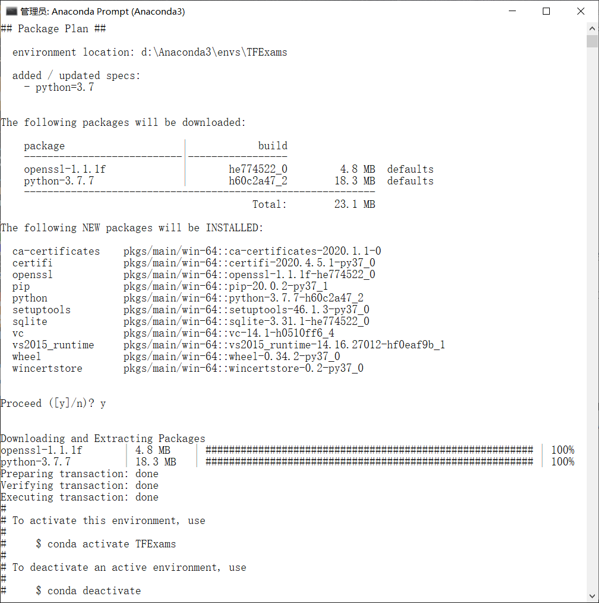
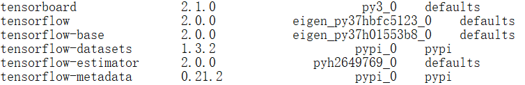
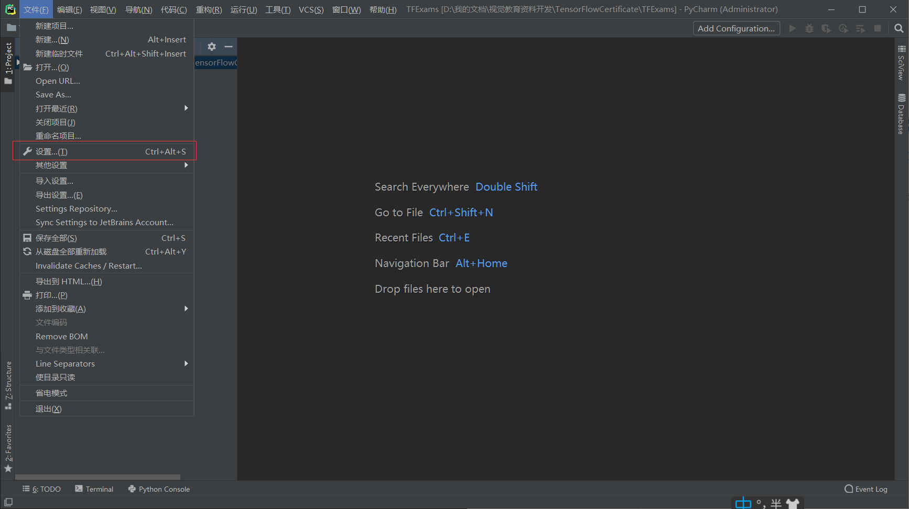
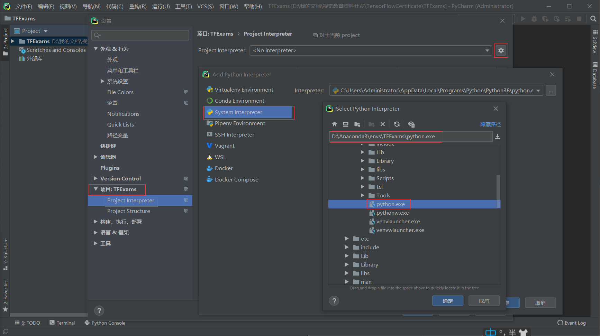
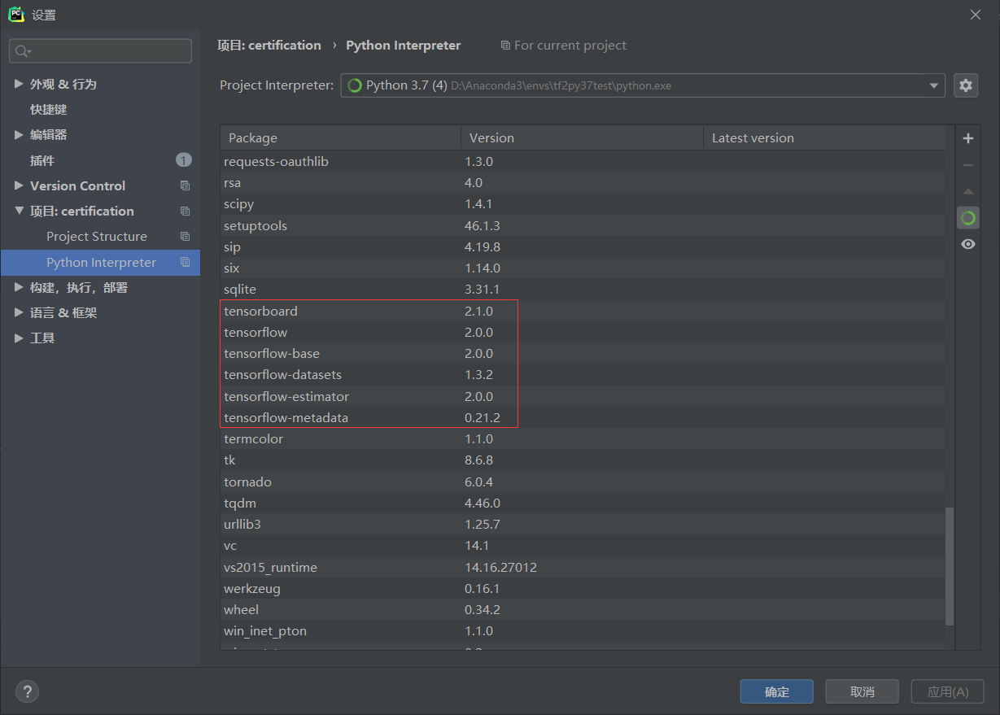
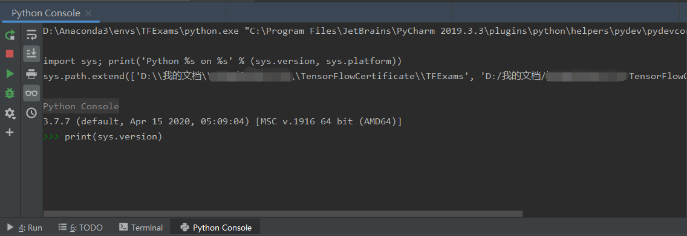
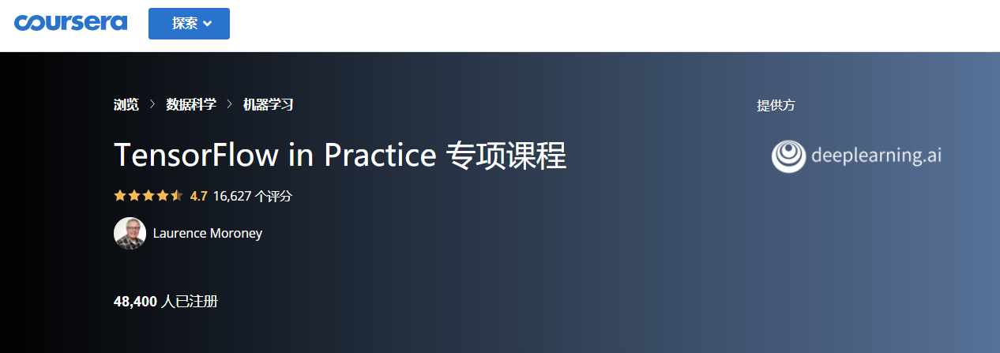
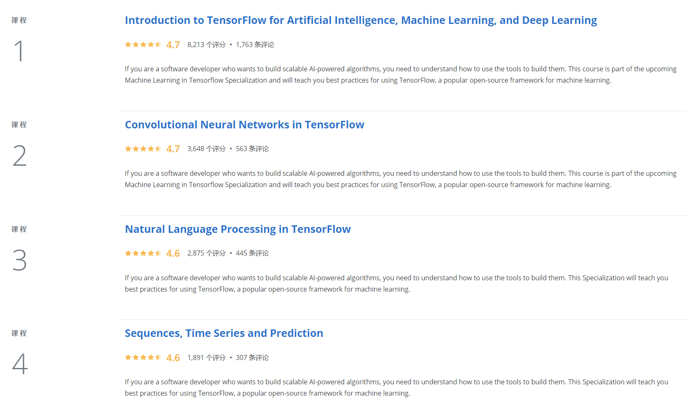
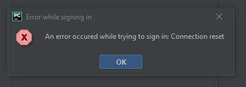

# 考试流程

TensorFlow Certificate 官方网站：https://tensorflow.google.cn/certificate?hl=vi


## 1. 阅读考生手册

提前阅读最新的考生手册，官方文档 TF_Certificate_Candidate_Handbook 的下载地址如下：

https://tensorflow.google.cn/site-assets/downloads/marketing/cert/TF_Certificate_Candidate_Handbook.pdf

### 考试细节

#### 考核目的

本次测试是为了考核学员应用 TensorFlow 2.x 构建模型 解决实际问题的能力。

该等级的证书考试主考查开发人员将机器学习集成到工具和应用程序中的基本知识。要获得证书需要理解如何使用计算机视觉、卷积神经网络、自然语言处理以及真实世界的图像数据和策略来构建TensorFlow模型。

为了成功地参加考试，考生应熟悉：

- 机器学习和深度学习的基本规则和方法
- 在TensorFlow 2.x中建立机器学习模型
- 用深层神经网络和卷积神经网络建立图像识别、目标检测、文本识别算法
- 使用不同尺寸的真实图像通过卷积提取体现特征，理解计算机如何“看到”信息，绘制损失和精度曲线

- 尝试防止过拟合的策略，包括数据增强和dropout
- 用神经网络求解自然语言处理问题

#### 考核内容

**(1) 搭建和训练神经网络模型**

- 使用 TensorFlow 2.x
- 搭建、编译和训练 机器学习模型
- 数据预处理
- 使用模型进行推理
- 搭建多层网络
- 搭建和训练**二分类模型**
- 搭建和训练**多分类模型**
- 训练过程的损失和精度数据图表显示
- 调整策略防止过拟合，包括数据增强和dropout
- 预训练模型载入后继续训练（**迁移学习**）
- 从预训练模型中提取特征
- 确保输入数据的尺寸无误
- 确保测试集的尺寸和输入的尺寸匹配
- 确保网络输出数据和测试集的尺寸匹配
- 理解batch方式导入数据的意义
- 使用回调方法触发训练循环的结束
- 使用不同资源的datasets
- 使用不同格式的datasets，包括json和csv
- 使用tf.data.datasets中的datasets

**(2) 图像分类**

- 使用 Conv2D和pooling层搭建卷积神经网络
- 搭建和训练模型处理实际图像数据
- 理解如何使用卷积改善神经网络
- 使用不同维度和尺寸的实际图像数据
- 使用 **ImageDataGenerator**
- 理解 **ImageDataGenerator** 是如何根据文件目录结构生成图像标签的
- 使用深度神经网络和卷积神经网络 搭建 图像分类和目标检测的模型

**(3) 自然语言处理(NLP)**

- 使用TensorFlow搭建自然语言处理系统
- 准备模型使用的文本数据
- 使用二分类搭建模型识别文本片段
- 使用多分类搭建模型识别文本片段
- 在你的模型中使用词向量
- 在模型中使用LSTMs对文本进行分类，以进行二进制或多类分类
- 模型中增加RNN和GRU层
- 在模型中使用RNNS，LSTMs，GRU和CNNs处理文本
- 在现有的文本上训练LSTMs，以生成新的文本（例如歌曲和诗歌）

**(4) 时间序列，序列和预测**

- 使用时间序列、序列和预测这些模型进行训练和优化
- 准备时间序列的数据
- 理解MAE，并理解它用于评估序列模型精度的原理
- 在时间序列，序列和预测中使用RNNs和CNNs
- 知道何时使用尾随窗口和中心窗口
- 使用TensorFlow进行预测
- 准备特征值和标签
- 识别和补偿序列偏差
- 在时间序列，序列和预测中动态调整学习率

#### 考试环境

后面会详细说明如何进行考试环境配置，这里先简述如下：

- 需要PyCharm IDE环境和网络，可随时进行
- 执行TensorFlow模型进行在线的性能测试
- 需要在PyCharm IDE上安装 Google TensorFlow 考试插件

#### 考试时间

考试时间5小时，你可以提前交卷，如果时间不足，到5小时会自动提交。

#### 考试链接

https://app.trueability.com/google-certificates/tensorflow-developer

### 身份验证

中国公民需要提供有效的护照信息。

### 考试期间求助资源

考试期间你可以自由访问任何需要的学习资源。（新版本TF_Certificate_Candidate_Handbook中修改）

### 考试资格

个人身份参加，不得以公司或者组织身份参加考试

### 如何注册和支付

注册地址如下：

https://app.trueability.com/google-certificates/tensorflow-developer

按照要求填写信息注册，并支付单次考试100美元的费用。

### 查询结果

提交考试后，它将被评分，分数将被张贴到候选人门户，网站地址如下：https://app.trueability.com/user_sessions/new。 如果你通过了考试，证书将邮寄到注册的电子邮件地址。 如果您通过了考试，但在10个工作日内没有收到证书，或者如果您想选择不接受您的证书，请在tensorflow-certificate-team@google.com与我们联系。

### 重新考试

每次考试必须重新支付费用，重新参加开始的规定如下：

- 如果你不通过你的第一次尝试，你必须等待14天才能再次参加考试
- 如果你不通过你的第二次尝试，你必须等待两个月才能再次参加考试
- 如果经过三次尝试你仍然没有通过考试，你必须等待一年才能再次参加考试

### 证书有效期

证书有效期为3年

## 2. 注册考试

注册考试只需要按照网页提示的步骤进行即可，中国公民需要提供护照图片和信息，同时录入个人信用卡的相关信息，进行考试费用的预冻结。其中，区域编号如果不清楚可以直接填99613。

## 3. 准备考试

### 安装PyCharm IDE

下载并安装 PyCharm IDE


### 安装TensorFlow

第一步，在Anaconda中新增环境，Python版本为 3.7.x，环境名为TDExams

conda create --name TFExams python=3.7



第二步，切换到新创建的环境TFExams，conda activate TFExams

第三步，安装 tensorflow 2.0.0 和 tensorflow-datasets，**conda install tensorflow==2.0.0**，**conda install tensorflow-datasets==1.3.2**

如下所示：


下载和安装可能需要等待 5~10 分钟，直到终端提示 done 代表全部正常安装完成。

### 测试环境

安装完成后，测试下tensorflow-gpu是否正确安装

**第一步，配置PyCharm的Python环境为先前安装好TensorFlow-GPU的TFExams**

进入 文件 -> 设置



分别进入 项目并选择：TFExams -> Project Interpreter -> 设置 -> System Interpreter -> D:\Anaconda3\envs\TFExams\python.exe



看到环境中的类库正常识别，代表设置完成，如下图所示：



**第二步，新建测试程序并测试**

新建程序 TF2_GPU_Test.py,输入测试代码，如下：

```python
import tensorflow as tf
print(tf.__version__)
print(tf.test.is_gpu_available())
print(tf.test.is_built_with_cuda())
```

如果程序正常输出了 版本号和2个True ，就代表 tensorflow-gpu 已经安装成功。

同时在PyCharm的Python Console里输入 print(sys.version) ，确认Python版本是否为 3.7.x



## 4. 在线课程

强烈推荐 Coursera 中的在线课程（也是 TensorFlow Certificate 官网推荐的视频学习课程），由吴恩达 DeepLearning.ai 的 Laurence Moroney 老师主讲 ，该课程对 TensorFlow  Certificate 的知识面覆盖很好，通过逐步的视频、练习和测验，可以基本掌握 TensorFlow 基础的代码实战能力，该课程总共分 4 个子课程，全部完成后可以获得 5 个 DeepLearning.ai 颁发的结业证书。

**如果你能独立完成该专项课程的所有考试和代码，基本上通过 TensorFlow Certificate 是不太困难的。**



此专项课程包含 4 门课程：

1.  机器学习入门；
2.  卷积神经网络；
3.  自然语言识别；
4.  时间序列预测。




在线课程地址为：https://www.coursera.org/specializations/tensorflow-in-practice?

下面简单把每个课程的核心知识点梳理一下：

### 1. 机器学习入门

**① 机器学习的HelloWorld：用单层DNN网络搭建简单的线性回归模型**

**② keras搭建神经网络的3种方式：**

1. 序列式（sequential）；2. 函数式（functional）；3. 子类（subclassing）

**③ 深度学习 4 步走：**

-  创建模型

  用 **Sequential()** 构建网络的通用写法是 **Sequential（[layer1，……，layerN]）**

  常见的层如下：

  Dense()：全连接层

  Flatten()：展开层

  Dropout()：舍弃层 

  BatchNormalization()：批量标准化层

  Conv1D(), Conv2D()：一维、二维卷积层

  MaxPooling1D(),MaxPooling2D()：一维、二维最大池化层

  AveragePooling1D(), AveragePooling2D()：一维、二维平均池化层

  RNN()：循环层

  GRU()：门限循环单元层

  LSTM()：长短期记忆层

  Bidiretional()：双向层

  Embedding()：嵌入层

  Lambda()：任意表达式封装层

-  编译模型

  model.compile(optimizer, loss)

-  模型训练

  model.fit(x_train, y_train, epoch)

-  模型预测

  model.predict(x_new)

**④ Callback机制**

通过特定的回调方式，在每个epoch的结束的时候，设定loss或者accuracy的训练停止机制，代码如下：

```python
class myCallback(tf.keras.callbacks.Callback):
  def on_epoch_end(self, epoch, logs={}):
    if(logs.get('loss')<0.4):
      print("\nReached 0.4 loss so cancelling training!")
      self.model.stop_training = True

callbacks = myCallback()

……

model.fit(training_images, training_labels, epochs=5, callbacks=[callbacks])
```

**⑤ CNN 网络中间卷积层提取的信息可视化**

通过以图像的方式显示网络中间卷积层的数据，可以从中一窥CNN的各个卷积层对图像进行特征提取的原理，代码如下：

```python
import matplotlib.pyplot as plt
f, axarr = plt.subplots(3,4)
FIRST_IMAGE=0
SECOND_IMAGE=7
THIRD_IMAGE=26
CONVOLUTION_NUMBER = 1
layer_outputs = [layer.output for layer in model.layers]
activation_model = tf.keras.models.Model(inputs = model.input, outputs = layer_outputs)
for x in range(0,4):
  f1 = activation_model.predict(test_images[FIRST_IMAGE].reshape(1, 28, 28, 1))[x]
  axarr[0,x].imshow(f1[0, : , :, CONVOLUTION_NUMBER], cmap='inferno')
  axarr[0,x].grid(False)
  f2 = activation_model.predict(test_images[SECOND_IMAGE].reshape(1, 28, 28, 1))[x]
  axarr[1,x].imshow(f2[0, : , :, CONVOLUTION_NUMBER], cmap='inferno')
  axarr[1,x].grid(False)
  f3 = activation_model.predict(test_images[THIRD_IMAGE].reshape(1, 28, 28, 1))[x]
  axarr[2,x].imshow(f3[0, : , :, CONVOLUTION_NUMBER], cmap='inferno')
  axarr[2,x].grid(False)
```

**⑥ 图像预处理 ImageDataGenerator() 初识**

ImageDataGenerator 可以在训练时，对图像进行按需实时（on the fly）的处理，而不必改变原始图片，操作完成在内存中进行，用完销毁，十分方便。

下述示例为图像归一化：

```python
train_datagen = ImageDataGenerator(rescale=1.0/255.0)
```


### 2. 卷积神经网络

**① 数据增强 ImageDataGenerator() 深入**

数据增强是图像分类中提高精度，防止过拟合的一个有效方式，通过ImageDataGenerator() 可以十分方便地进行数据增强，常用的数据增强的参数设定如下：

- **rotation_range**：旋转图片 40 度
- **width_shift_range**：横向移动 20%
- **height_shift_range**：纵向移动 20%
- **shear_range**：逆时针剪切 20% 强度
- **zoom_range**：放大 20% 强度
- **horizontal_filp**：是否水平翻转
- **fill_mode**：缺失值如何被填满

**② 迁移学习 transfer learning**

数据集不足的时候（这在工业领域非常常见，一般缺陷品数量会远远少于良品），除了数据增强以外，另一个有效的方式是迁移学习 transfer learning，俗称 “站在巨人的肩膀上”。

简单地叙述，迁移学习一般的流程为：载入成熟的模型 -> 载入超大数据集训练出的参数 -> 锁住预训练模型中的参数不参与新的训练 -> 从预训练模型的后面几层 连接新的几层DNN网络 -> 使用新的数据集重新训练最后新增的几层网络

常用的使用InceptionV3的迁移学习代码如下：

```python
  
from tensorflow.keras.applications.inception_v3 import InceptionV3

local_weights_file = '/tmp/inception_v3_weights_tf_dim_ordering_tf_kernels_notop.h5'

pre_trained_model = InceptionV3(input_shape = (150, 150, 3), 
                                include_top = False, 
                                weights = None)

pre_trained_model.load_weights(local_weights_file)

for layer in pre_trained_model.layers:
  layer.trainable = False
  
# pre_trained_model.summary()

last_layer = pre_trained_model.get_layer('mixed7')
print('last layer output shape: ', last_layer.output_shape)
last_output = last_layer.output

from tensorflow.keras.optimizers import RMSprop

# Flatten the output layer to 1 dimension
x = layers.Flatten()(last_output)
# Add a fully connected layer with 1,024 hidden units and ReLU activation
x = layers.Dense(1024, activation='relu')(x)
# Add a dropout rate of 0.2
x = layers.Dropout(0.2)(x)                  
# Add a final sigmoid layer for classification
x = layers.Dense  (1, activation='sigmoid')(x)           

model = Model( pre_trained_model.input, x) 

model.compile(optimizer = RMSprop(lr=0.0001), 
              loss = 'binary_crossentropy', 
              metrics = ['accuracy'])
```


### 3. 自然语言识别

**① keras 单词编码工具包 Tokenizer**

使用Tokenizer对句子中的词语进行编码，并生成编解码字典。代码如下：

```python
import tensorflow as tf
from tensorflow.keras.preprocessing.text import Tokenizer
from tensorflow.keras.preprocessing.sequence import pad_sequences

tokenizer = Tokenizer()
tokenizer.fit_on_texts(sentences)

word_index = tokenizer.word_index
vocab_size=len(word_index)

sequences = tokenizer.texts_to_sequences(sentences)
padded = pad_sequences(sequences, maxlen=max_length, padding=padding_type, truncating=trunc_type)
```

其中，fit_on_texts 根据句子中的词频自动生成词编码；word_index 用于获取生成的编码字典；texts_to_sequences 应用生成的编码字典将句子转换成整数序列；pad_sequences 将编码后的序列列表的各个元素进行填充，以确保列表中各序列的长度一致；

如果是小训练集进行生成，可能存在词种类不足，解决方法是用 oov_token 来表示未知新词，OOV 是 Out-Of-Vocabulary 的缩写，只需在 Tokenizer 里面多加一个参数 oov_token="< OOV >" 。


**② keras word2vec工具包 Embedding**

Tokenizer 只是将词简单地按照词频转换成整数序列，并没有理解词与词之间的关系，这样就无法准确理解句子的含义或者生成有意义的新句子。一般的解决方案是把整数序列用 one-hot 编码转成高维稀疏向量再转成低维密集向量，因此一个词可能用 100D, 300D 或 500D 的向量来表示，而词与词之间的相似度就用向量之间内积表示。这个过程就叫做 word2vec，即把单词转成换向量的过程，在 keras 里用 Embedding() 来实现。这个操作放在最开始，一个好的 embedding 是整个模型好快的关键。之后可以用 LSTM 层 或 Conv1D 层 来拼接。代码如下：

```python
embeddings_matrix = np.zeros((vocab_size+1, embedding_dim));
for word, i in word_index.items():
    embedding_vector = embeddings_index.get(word);

model = tf.keras.Sequential([
    tf.keras.layers.Embedding(vocab_size+1, embedding_dim, input_length=max_length, weights=[embeddings_matrix], trainable=False),
    tf.keras.layers.Dropout(0.2),
    tf.keras.layers.Conv1D(64, 5, activation='relu'),
    tf.keras.layers.MaxPooling1D(pool_size=4),
    tf.keras.layers.LSTM(64),
    tf.keras.layers.Dense(1, activation='sigmoid')
])
model.compile(loss='binary_crossentropy',optimizer='adam',metrics=['accuracy'])
```


### 4. 时间序列预测

简单地说，时间序列预测就是给定一段序列 S(1), S(2), ... S(t)，预测 S(t+1)。一般的时间序列由下面的结构组成：

时间序列 = 季节性 + 趋势 + 自相关 + 噪声

一般的时间预测流程为：使用 windowed 制作训练集和验证集 -> 搭建不同的 Dense 层, LSTM 层和 Conv1D 层 -> 模型编译、训练和预测。

自动滑动窗体生成训练集的代码如下：

```python
def windowed_dataset(series, window_size, batch_size, shuffle_buffer):
    series = tf.expand_dims(series, axis=-1)
    ds = tf.data.Dataset.from_tensor_slices(series)
    ds = ds.window(window_size + 1, shift=1, drop_remainder=True)
    ds = ds.flat_map(lambda w: w.batch(window_size + 1))
    ds = ds.shuffle(shuffle_buffer)
    ds = ds.map(lambda w: (w[:-1], w[1:]))
    return ds.batch(batch_size).prefetch(1)
```

搭建模型和编译训练：

```python
model = tf.keras.models.Sequential([
  tf.keras.layers.Conv1D(filters=32, kernel_size=5,
                      strides=1, padding="causal",
                      activation="relu",
                      input_shape=[None, 1]),
  tf.keras.layers.LSTM(64, return_sequences=True),
  tf.keras.layers.LSTM(64, return_sequences=True),
  tf.keras.layers.Dense(30, activation="relu"),
  tf.keras.layers.Dense(10, activation="relu"),
  tf.keras.layers.Dense(1),
  tf.keras.layers.Lambda(lambda x: x * 400)
])

lr_schedule = tf.keras.callbacks.LearningRateScheduler(
    lambda epoch: 1e-8 * 10**(epoch / 20))
optimizer = tf.keras.optimizers.SGD(lr=1e-8, momentum=0.9)
model.compile(loss=tf.keras.losses.Huber(),
              optimizer=optimizer,
              metrics=["mae"])
history = model.fit(train_set, epochs=100, callbacks=[lr_schedule])
```

模型预测，计算mae：

```python
def model_forecast(model, series, window_size):
    ds = tf.data.Dataset.from_tensor_slices(series)
    ds = ds.window(window_size, shift=1, drop_remainder=True)
    ds = ds.flat_map(lambda w: w.batch(window_size))
    ds = ds.batch(32).prefetch(1)
    forecast = model.predict(ds)
    return forecast

rnn_forecast = model_forecast(model, series[..., np.newaxis], window_size)
rnn_forecast = rnn_forecast[split_time - window_size:-1, -1, 0]

tf.keras.metrics.mean_absolute_error(x_valid, rnn_forecast).numpy()
```

**超参数之学习率的选择**

时间序列预测问题，最佳学习率的选择是比较困难的，一般通过 **LearningRateScheduler** 作为 callbacks 找到一个最优学习率，然后设置该学习率进行重新训练。

代码如下：

```python
lr_schedule = tf.keras.callbacks.LearningRateScheduler(
    lambda epoch: 1e-8 * 10**(epoch / 20))
optimizer = tf.keras.optimizers.SGD(lr=1e-8, momentum=0.9)
model.compile(loss=tf.keras.losses.Huber(),
              optimizer=optimizer,
              metrics=["mae"])
history = model.fit(train_set, epochs=100, callbacks=[lr_schedule])
```


## 5. 参加考试

考试时间总共有 5 小时，在下载并注册考试插件后开始计时。如果没能在 5 小时内完成考试，那到时间也会自动提交代码。
整场考试主要测试学生使用 TensorFlow 构建模型、解决问题的能力。在考试中，参与者需要完成 5 个模型，每一个都属于不同的类别。考试总分 100 分，过了 90 分就算合格，也就是说 5 个模型都要完成，且只能有一些小错误。
考试涉及的模型类别如下：

第一类：基础、简单模型

第二类：基于学习数据集的模型

第三类：采用真实图像数据训练卷积神经网络

第四类：采用真实文本数据训练 NLP 文本分类模型

第五类：采用真实数值数据训练序列模型

**注意事项：每一题完成后都需要单独提交和测试，并确认得分情况，确保尽量全部满分后，再提交全部试题。**

## 6. 查询成绩

考试结束后，可以直接登陆注册的网站，查询是否通过。（一般情况下，提交并结束考试后是可以立即知道结果的，官方的说明是24小时内告知结果。）

如果通过的话，你会在2周内收到TensorFlow发放的证书，并在全球 TensorFlow Certificate 证书网络中看到你的个人信息。

## 7. 展示成果

最后，就是展示成果的环节啦，你可以在LinkedIn等平台上登陆并展示你的证书！

祝你通过上述的学习 也能顺利通过 TensorFlow Certificate 认证！

## 附录：考试过程可能遇到的问题和解决方案

### ①  pycharm登陆账户报错

**问题描述：**

授权页面上面提示登录成功了，但是返回pycharm时提示登陆错误




**解决方式：**

一般是国内翻墙问题导致，可以通过设置pycharm里面的proxy，并且必须重启pycharm。


